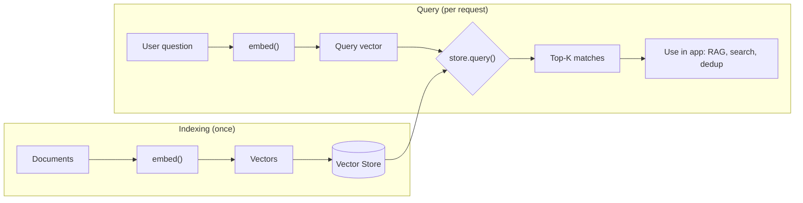

# Embeddings

Embeddings turn text into numeric vectors that capture meaning, enabling semantic search, clustering, deduplication, and Retrieval-Augmented Generation. WebFiori AI generates embeddings through `embed()` and ships a built-in vector store for similarity search. Embeddings are supported by OpenAI and Google (see [Providers](learn/ai-providers)).

<meta name="description" content="Generate text embeddings with WebFiori AI and run semantic search using the built-in InMemoryVectorStore.">

## The Workflow

The typical flow is to embed and store your documents once, then embed each query and find the nearest vectors:



## Generating Embeddings

Pass a single string or an array of strings. `embed()` returns an `EmbeddingResponse`:

```php
use WebFiori\Ai\Provider\OpenAI\OpenAIClient;
use WebFiori\Ai\Provider\OpenAI\OpenAIClientConfig;

$client = new OpenAIClient(new OpenAIClientConfig(apiKey: 'sk-...', model: 'gpt-4o'));

$response = $client->embed(
    ['How do I reset my password?', 'Account recovery steps'],
    ['model' => 'text-embedding-3-small'],
);

echo $response->getModel().PHP_EOL;
echo $response->getDimensions().PHP_EOL;   // vector length

$vectors = $response->getVectors();        // array of float[] vectors
$first   = $response->getVector();          // convenience: the first vector
```

## Semantic Search with the Vector Store

`InMemoryVectorStore` stores vectors with metadata and returns the most similar records for a query vector:

```php
use WebFiori\Ai\Embedding\InMemoryVectorStore;

$documents = [
    ['id' => 'doc-1', 'text' => 'PHP is a server-side scripting language.'],
    ['id' => 'doc-2', 'text' => 'Composer is the dependency manager for PHP.'],
    ['id' => 'doc-3', 'text' => 'React is a JavaScript UI library.'],
];

// Index once
$store   = new InMemoryVectorStore();
$texts   = array_column($documents, 'text');
$vectors = $client->embed($texts, ['model' => 'text-embedding-3-small'])->getVectors();

foreach ($documents as $i => $doc) {
    $store->store($doc['id'], $vectors[$i], ['text' => $doc['text']]);
}

// Query per request
$queryVector = $client->embed('How do I manage packages in PHP?', [
    'model' => 'text-embedding-3-small',
])->getVector();

$results = $store->query($queryVector, topK: 3);

foreach ($results as $record) {
    printf("[%.3f] %s\n", $record->getScore(), $record->getMetadata()['text']);
}
```

Each result is a `VectorRecord` exposing `getId()`, `getScore()`, `getVector()`, and `getMetadata()`.

## Filtering by Metadata

`query()` accepts a metadata filter so only records matching all given key/value pairs are considered:

```php
$store->store('doc-1', $vectors[0], ['text' => '...', 'topic' => 'php']);
$store->store('doc-3', $vectors[2], ['text' => '...', 'topic' => 'javascript']);

$phpOnly = $store->query($queryVector, topK: 3, filter: ['topic' => 'php']);
```

## Persistent Stores

`InMemoryVectorStore` lives for the request. For persistence across requests, the library also provides file- and SQLite-backed stores implementing the same `VectorStorageInterface`, so you can swap the store without changing your query code.

## Where to Next

See [RAG](learn/ai-rag) to combine retrieval with chat and ground answers in your data, or [Image Generation](learn/ai-image-generation) to generate images from prompts.
