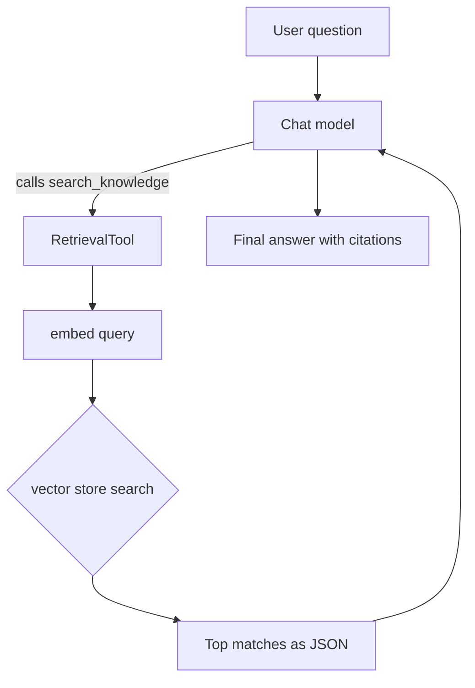

# Retrieval-Augmented Generation (RAG)

RAG grounds the model's answers in your own documents. You store your content as embeddings, retrieve the most relevant pieces for a question, and let the model answer from them. In WebFiori AI, retrieval is exposed as a tool the chat model can call, so the model decides when it needs to search.

<meta name="description" content="Build a RAG pipeline with WebFiori AI: chunk and embed documents, retrieve relevant chunks with Retriever, and expose retrieval to the model as a tool.">

## How It Works

Retrieval is implemented as a tool rather than a wrapper around `chat()`. The chat model and the embedding model stay independent: the model never sees raw vectors, it only receives the tool's result as structured text.



## The Components

The building blocks live under `WebFiori\Ai\Rag` and `WebFiori\Ai\Embedding`:

- `TextChunker` splits documents into overlapping chunks.
- A vector store (`InMemoryVectorStore`, `FileVectorStore`, or `SqliteVectorStore`) persists the embeddings.
- `Retriever` embeds a query and searches the store.
- `RetrievalTool` exposes the retriever to the chat model as a callable tool.

## Ingesting Documents

Chunk each document, embed each chunk, and store the vectors with their metadata. You do this once per document:

```php
use WebFiori\Ai\Provider\OpenAI\OpenAIClient;
use WebFiori\Ai\Provider\OpenAI\OpenAIClientConfig;
use WebFiori\Ai\Embedding\SqliteVectorStore;
use WebFiori\Ai\Rag\TextChunker;

$embedder = new OpenAIClient(new OpenAIClientConfig(apiKey: 'sk-...', model: 'gpt-4o'));
$store    = new SqliteVectorStore(__DIR__.'/knowledge.db');
$chunker  = new TextChunker(chunkSize: 2000, overlap: 400);

$document = file_get_contents('handbook.txt');
$chunks   = $chunker->chunk($document, ['source' => 'handbook.txt']);

foreach ($chunks as $chunk) {
    $vector = $embedder->embed($chunk->getText())->getVector();
    $store->store($chunk->getId(), $vector, $chunk->getAllMetadata());
}
```

## Retrieving Directly

You can query the store through a `Retriever` without involving the chat model. This is useful for search features or for inspecting what retrieval returns:

```php
use WebFiori\Ai\Rag\Retriever;

$retriever = new Retriever($embedder, $store);
$results   = $retriever->retrieve('What is the refund policy?', topK: 3);

foreach ($results as $result) {
    printf("[%.3f] %s\n", $result->getScore(), $result->getText());
    echo 'Source: '.($result->getSource() ?? 'n/a').PHP_EOL;
}
```

Each `RetrievalResult` exposes `getText()`, `getScore()`, `getSource()`, and `getMetadata()`. You can also set a minimum score so weak matches are dropped:

```php
$retriever = new Retriever($embedder, $store, ['min_score' => 0.75]);
```

## Letting the Model Retrieve

Wrap the retriever in a `RetrievalTool` and pass it as a tool. With `auto_execute_tools`, the model searches the knowledge base on its own when a question calls for it:

```php
use WebFiori\Ai\ChatOption;
use WebFiori\Ai\Message;
use WebFiori\Ai\Rag\RetrievalTool;

$ragTool = new RetrievalTool($retriever);

$response = $chatClient->chat(
    [
        new Message('system', 'Use the search tool to find relevant information before answering.'),
        new Message('user', 'What does the handbook say about remote work?'),
    ],
    [
        ChatOption::TOOLS              => [$ragTool],
        ChatOption::AUTO_EXECUTE_TOOLS => true,
    ]
);

echo $response->getMessage()->getContent();
```

See [Tool Calling](learn/ai-tool-calling) for the full tool-calling model, including the manual loop.

## Choosing a Vector Store

| Store | Best for | Persistence |
|-------|----------|-------------|
| `InMemoryVectorStore` | tests and tiny datasets | none |
| `FileVectorStore` | small datasets | JSON files |
| `SqliteVectorStore` | medium datasets | SQLite |

All three implement `VectorStorageInterface`, so you can start in memory and move to a persistent store later without changing your retrieval code. For very large datasets, implement the interface over a dedicated vector database.

## Provider-Backed RAG

Besides the local vector-store approach, the library ships providers that delegate retrieval to managed services (for example Google Vertex AI RAG and AWS Bedrock Knowledge Bases). They implement the same `RagProviderInterface`, so the retrieval-as-a-tool pattern stays the same.

## Where to Next

See [Embeddings](learn/ai-embeddings) for the vector basics behind retrieval, or [Tool Calling](learn/ai-tool-calling) for how the model invokes the retrieval tool.
