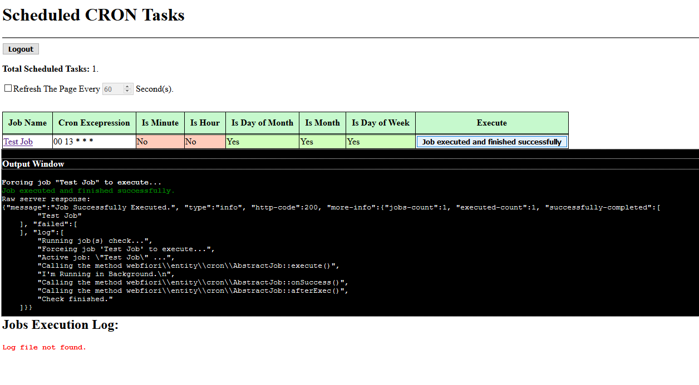
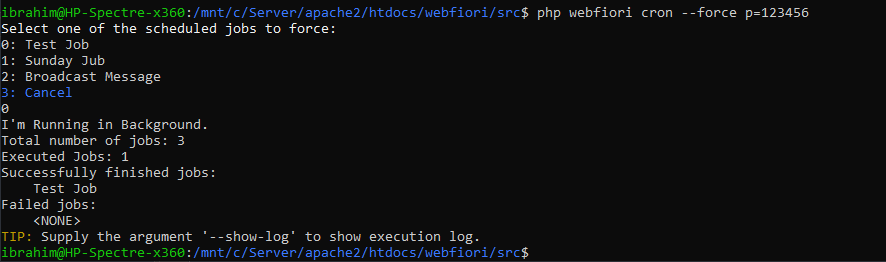
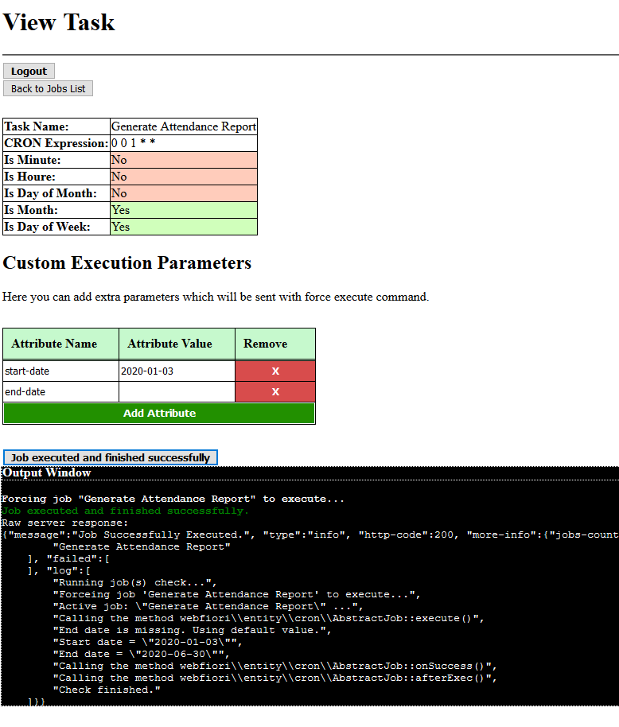
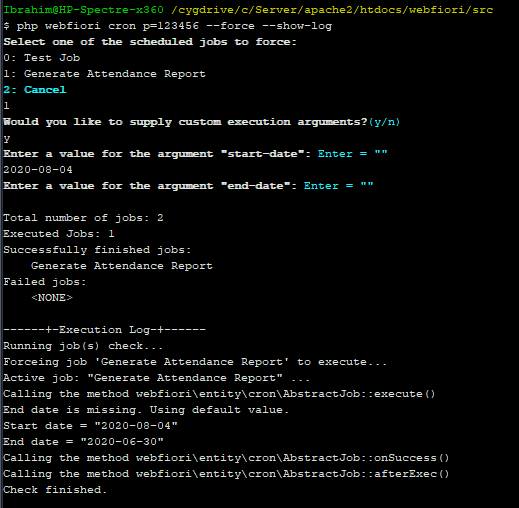

# Background Tasks

<meta name="description" content="Background tasks are used to run even if there is no one is using the application. Learn about how to implement and use them here.">

In this page:

* [Introduction](#introduction)
* [Main Classes](#main-classes)
  * [The Class `AbstractJob`](#the-class-abstractjob)
  * [The Class `CronJob`](#the-class-cronjob)
  * [The Class `Cron`](#the-class-cron)
  * [The Class `InitCron`](#the-class-initcron)
* [Scheduling Jobs](#scheduling-jobs)
  * [Scheduling Job as a Closure](#scheduling-job-as-a-closure)
  * [Using the Class `AbstractJob`](#using-the-class-abstractjob)
* [Jobs Execution](#jobs-execution)
  * [Using `crontab` Entry to Trigger Execution](#using-crontab-entry-to-trigger-execution)
  * [Using Command Line Interface to Trigger Execution](#using-command-line-interface-to-trigger-execution)
  * [Forcing a Job to Execute](#forcing-a-job-to-execute)
    * [Force a Job to Execute Using Cron Web Interface](#force-a-job-to-execute-using-cron-web-interface)
    * [Force a Job to Execute Using Command Line Interface](#force-a-job-to-execute-using-command-line-interface)
* [Using Arguments With Forced Jobs](#using-aguments-with-forced-jobs)
  * [Sending Arguments Throgh CRON Web Interface](#sending-arguments-throgh-cron-web-interface)
  * [Sending Arguments Throgh Terminal](#sending-arguments-throgh-terminal)
* [Sending CRON Notifications](#sending-cron-notifications)
  * [The Class `CronEmail`](#the-class-cronemail)

## Introduction

One of the features of the framework is the ability to schedule PHP code to run at specific time in the background. For example, it is possible to make your web application send reports at specific time using email or any comunication way. The framework give the developers all needed tools to schedule background tasks in a very simple way.

## Main Classes

The sub-system which is responsible for scheduling jobs consist of 4 main classes. In order to schedule jobs, we have to use at least the first one. The classes are:

* The class [`AbstractJob`](https://webfiori.com/docs/webfiori/framework/cron/AbstractJob)
* The class [`CronJob`](https://webfiori.com/docs/webfiori/framework/cron/CronJob)
* The class [`Cron`](https://webfiori.com/docs/webfiori/framework/cron/Cron)
* The class [`InitCron`](https://webfiori.com/docs/webfiori/framework/cron/InitCron)

There are other classes that makes the system for scheduling jobs works but they are mainly utility class. In order to schedule a job, mostly we have to work with the 4 given classes.

### The Class `AbstractJob`

This class has all needed methods for created a custom job. The developer can extend this class and implement the abstract methods to create the job. The class has 4 abstract methods which can be implemented:

* [`AbstractJob::execute()`](https://webfiori.com/docs/webfiori/framework/cron/AbstractJob#execute)
* [`AbstractJob::afterExec()`](https://webfiori.com/docs/webfiori/framework/cron/AbstractJob#afterExec)
* [`AbstractJob::onFail()`](https://webfiori.com/docs/webfiori/framework/cron/AbstractJob#onFail)
* [`AbstractJob::onSuccess()`](https://webfiori.com/docs/webfiori/framework/cron/AbstractJob#onSuccess)

### The Class `CronJob`

This class provides basic implementation for the class `AbstractJob`. The developer can create an instance of this class and schedule it directly.

### The Class `Cron`

This class is the controller for jobs scheduling system. This class performs many operations including jobs management, executing jobs, trigger job execution and so on.

### The Class `InitCron`

This class is one of the framework initialization classes. The class is used to initialize the scheduled jobs. The developer can use it to create an instance of his job and schedule it there. The class has one ststic method which is [`InitCron::init()`](https://webfiori.com/docs/webfiori/ini/InitCron#init). The developer can modify the body of the method as he needs.

## Scheduling Jobs

A job can be created using one of two ways, As a closure, or by extending the class [`AbstractJob`](https://webfiori.com/docs/webfiori/framework/cron/AbstractJob).

### Scheduling Job as a Closure

The easiest and simplest way is to schedule a job as a closure. To schedule a job as a closure, we have to use the class [`Cron`](https://webfiori.com/docs/webfiori/framework/cron/Cron). The class has many pre-made methods which can be used to schedule jobs as closures in diffrent tomes. These methods include the following ones:

* [`Cron::createJob()`](https://webfiori.com/docs/webfiori/framework/cron/Cron#createJob): Schedule a job using specific cron expression.
* [`Cron::dailyJob()`](https://webfiori.com/docs/webfiori/framework/cron/Cron#dailyJob): Schedule a job to run every day at specific time.
* [`Cron::monthlyJob()`](https://webfiori.com/docs/webfiori/framework/cron/Cron#monthlyJob): Schedule a job to run once every month in a specific day and time.
* [`Cron::weeklyJob()`](https://webfiori.com/docs/webfiori/framework/cron/Cron#weeklyJob): Schedule a job to run once every week in a specific day and time.

The following code sample shows how to use each one of the methods to schedule jobs.

``` php
namespace webfiori\ini;

use webfiori\framework\cron\Cron;

class InitCron {
    /**
     * A method that can be used to initialize cron jobs.
     * The developer can use this method to create cron jobs.
     * @since 1.0
     */
    public static function init() {

        Cron::createJob('*/10 * * * *', 'Every Minute', function () {
            echo "Will execute every 10 minutes";
        });
        
        Cron::dailyJob("13:00", "Test Job", function () {
            echo "Will execute every day at 1:00 PM";
        });
        
        Cron::weeklyJob('sun-15:30', 'Another Job', function () {
            echo "Will execute every sunday at 3:30 PM";
        });
        
        Cron::monthlyJob(1, '00:00', 'First Day Of Month', function () {
            echo "Will execute at first day of every month at 12:00 AM";
        });
    }
}
```

### Using the Class `AbstractJob`

If the job that will be scheduled is simple, it is recomended to schedule it as closure. But if the job is complex, it is recomended to implement it as a class to make it easier when managing it. In order to implement a job as a class, the class [`AbstractJob`](https://webfiori.com/docs/webfiori/framework/cron/AbstractJob) must be extended.

As we have said before, this class has 4 abstract methods at which the developer can implement. The method [`AbstractJob::execute()`](https://webfiori.com/docs/webfiori/framework/cron/AbstractJob#execute) will contain the actual job code that will be executed when it is time to run the job. The method must return a boolean value or null. If the job successfully executed, it must return `true` or `null`. If the job fails, the method must return `false`. Note that if the method throws an exception or error while it executes, the job will be considered as failed.

The method [`AbstractJob::onFail()`](https://webfiori.com/docs/webfiori/framework/cron/AbstractJob#onFail) can have a code that will be executed if the job has failed to complete successfully. For example, it can have a code that will notify system admins that a background job has failed. A job will be considered as a failed job in two cases. If the method [`AbstractJob::execute()`](https://webfiori.com/docs/webfiori/framework/cron/AbstractJob#execute) return `false` or when it throws an exception.

The method [`AbstractJob::onSuccess()`](https://webfiori.com/docs/webfiori/framework/cron/AbstractJob#onSuccess) can have a code that will be executed if the job finished without any issues. A job is considered as a success job when the method [`AbstractJob::execute()`](https://webfiori.com/docs/webfiori/framework/cron/AbstractJob#execute) returns `true` or `null` (simply return nothing).

The method [`AbstractJob::afterExec()`](https://webfiori.com/docs/webfiori/framework/cron/AbstractJob#afterExec) can have a code which will be executed after the job finished to execute. The code will get executed in both cases, success or fail.

#### A Sample Job

The developer can place the class that represents the job in any directory as long as it is in autoload directories. But if the developer would like from the framework to auto-register the job, he can place it in the folder `app/jobs`. The following code shows a sample job that writes a text to a file.

``` php
namespace webfiori\framework\cron;

use webfiori\framework\cron\AbstractJob;
use webfiori\framework\File;

class WriteFileJob extends AbstractJob{
    public function __construct() {
        parent::__construct('Write File Job');
        //Execute job every 1 hour
        $this->everyHour();
    }
    public function afterExec() {
        // A code that will get executed after job compleition.
    }

    public function execute() {
        // This is the code that will be get executed.
        $file = new File('Background Job File.txt', ROOT_DIR);
        $file->setRawData('The job "'.$this->getJobName().'" was executed at '.date('H:i')."\n");
        $file->write();
    }

    public function onFail() {
        // A code that will get executed only when the job fails.
    }

    public function onSuccess() {
        // A code that will get executed only when the job successfully run.
    }

}
```

After implementing the job, it must be registered. If the class is placed in the folder `app/jobs`, then the registration process will be automatic. If the job class is somewhere else, then it must be registered manualy. The developer can use the method [`Cron::scheduleJob()`](https://webfiori.com/docs/webfiori/framework/cron/Cron#scheduleJob) to register jobs. The code which can be used to register a job can be placed in the class `InitCron`. The following code shows how it is done.

``` php
namespace webfiori\ini;

use webfiori\framework\cron\Cron;
use webfiori\framework\cron\WriteFileJob;

class InitCron {
    /**
     * A method that can be used to initialize cron jobs.
     * The developer can use this method to create cron jobs.
     * @since 1.0
     */
    public static function init() {

        Cron::scheduleJob(new WriteFileJob());
    }
}

```

## Jobs Execution

When a job is scheduled, it will not get executed by it self even if it is time to run it. A job can be only get executed if there was a trigger that caused it to execute. The trigger can be a forced trigger or automatic trigger.

### Using `crontab` Entry to Trigger Execution

The recomended way is to add a CRON entry on your server which looks like this one: `* * * * * php webfiori cron p="pass" --check`. This will execute the command `cron` of the framework with the option `--check` every minute. The option `pass` must be included if a password is set to protect jobs from unauthorized execution. It will simply check all scheduled jobs and to check if it is time to execute them. Note that the path to PHP interpreter and the framework my differ. Because of this, the format of the entry may differ.

If the server is runnig on windows, it is possible to use "Task Scheduler" to achieve the same result.

### Using Command Line Interface to Trigger Execution

Another way to trigger jobs execution is to use command line interface (or terminal) to run the command `cron`. If the server supports SSH access, it is possible to run the following command to trigger execution:

``` 
php webfiori cron p="pass" --check
```

Executing jobs through terminal can be usefull if the developer would like to inspect the output of jobs or would like to check what causes a job to fail.

### Forcing a Job to Execute

One of the features of the framework is the ability to force a scheduled job to execute even if it is not the time to run it. A job can be forced to run using one of two methods:

* Cron web interface.
* Command line interface.

#### Force a Job to Execute Using Cron Web Interface

If the constant `CRON_THROUGH_HTTP` is defined and is set to `true`, it will be possible to access cron web interface and use it to force a job to execute. The control panel can be accessed using any web browser by navigating to the URL `https://yoursite.com/cron`. If a password is set to protect the jobs, it will open a login page to enter protection password.



#### Force a Job to Execute Using Command Line Interface

Forcing a job to execute thorugh terminal is useful in case of debugging. The terminal can be used to show the full output of executing a job. To force execution of a specific job, simply we have to run the following command:

```
php webfiori cron p="pass" --force
```

Once this command is executed, the terminal will ask the user to select one of the scheduled jobs to force. The following image shows the full terminal output when using this way to force a job.



## Using Arguments With Forced Jobs

One of the things that a developer might want from a job to do is when it is forced to execute is to behave in a diffrent way based on some inputs given by the one who will execute it. One of the features that the framework provides is the ability to add custom execution arguments to a job. The arguments can be sent to the job when it is firced to execute throgh the control panel of the jobs or throgh command line interface.

### Adding Arguments

Job arguments are associated with an instance of the class `AbstractJob`. In order to add arguments to a job, simply use the method [`AbstractJob::addExecutionArg()`](https://webfiori.com/docs/webfiori/framework/cron/AbstractJob#addExecutionArg). Also, it is possible to add multiple arguments at once using the method [`AbstractJob::addExecutionArgs()`](https://webfiori.com/docs/webfiori/framework/cron/AbstractJob#addExecutionArgs). Ususlly, arguments are added to the job when initialized (in the constructor). But it is possible to add them after the job has been scheduled.

The following code sample shows how to add arguments to job.
``` php
namespace webfiori\framework\cron;

use webfiori\framework\cron\AbstractJob;
use webfiori\frameworl\cron\Cron;

class GenerateAttendanceReportJob extends AbstractJob {
    public function __construct() {
        parent::__construct('');
        
        //Generate attendance report once the new month start.
        $this->everyMonthOn(1, '00:00');
        
        // Add two arguments
        $this->addExecutionArgs([
            'start-date',
            'end-date',
        ]);
    }
    public function afterExec() {
        //TODO:
    }

    public function execute() {
        //Access argument value.
        $startDate = $this->getArgValue('start-date');
        if ($startDate === null) {
            Cron::log('Start date is missing. Using default value.');
            //TODO: Set a default start date which should be the start of prev month
            $startDate = '2020-06-01';
        }
        
        $endDate = $this->getArgValue('end-date');
        if ($endDate === null) {
            Cron::log('End date is missing. Using default value.');
            //TODO: Set a default start date which should be the start of prev month
            $endDate = '2020-06-30';
        }
        Cron::log('Start date = "'.\$startDate.'"');
        Cron::log('End date = "'.\$endDate.'"');
        //TODO: Generate the report.
    }

    public function onFail() {
        //TODO: Notify using email that an error stopped the job.
    }

    public function onSuccess() {
        //TODO: Store generated reports and send them using email.
    }

}
```

### Sending Arguments Throgh CRON Web Interface

If the ability to execute cron jobs through HTTP is enabled, it will be possible to access cron control panel to force execution of a job. The access to the control panel can be enabled by defining the constant <code>CRON_THROUGH_HTTP</code> and setting its value to <code>true</code>. Assuming that the server has the URL "https://example.com", the cron control panel can be accessed throgh "https://example.com/cron".

To supply arguments to a job when forceing it to execute, simply navigate to the page that shows job information by clicking on its name in the page that lists all scheduled jobs. In the lower side of the page, there will be a table at which the user can see the names of the argumens. The next image shows the whole page that shows the details of the job.



### Sending Arguments Throgh Terminal

Another way to force jobs to execute is to use command line interface. The command `cron` is used to force the execution of a job. To force a job, simply supply the argument `--force` 

The following terminal output image shows how to force the job that was created using the code at the start of this page. Notice that if the job has extra arguments, it asks to supply them.



## Sending CRON Notifications

One of the things that the framework supports is the ability to send email notifications about jobs execution status. The notifications are useful and can be used to follow up with jobs execution and can be used to diagnose the cause of failure of a job when it fails.

> **Note**: Note that to use mailing service of the framework, SMTP account must be setup. To learn more about sending emails and how to do the setup, [click here](learn/sending-emails).

### The Class `CronEmail`

In order to send email notifications, the class [`CronEmail`](https://webfiori.com/docs/webfiori/framework/cron/CronEmail) must be used. This class can be used to send an email regarding the status of background job execution (failed or success). This class must be only used in one of the abstract methods of a background job since using it while no job is active will have no effect. It is recommended to create an instance of this class in the body of the method [`AbstractJob::afterExec()`](https://webfiori.com/docs/webfiori/framework/cron/AbstractJob#afterExec).

The following code sample shows how to use the class to send notifications to one email address. It assumes that there exist SMTP account which has the name `notifications` and it will be used to send the notifications.

``` php
namespace webfiori\framework\cron;

use webfiori\framework\cron\AbstractJob;
use webfiori\framework\cron\Cron;
use webfiori\framework\cron\CronEmail;

class GenerateAttendaceReportJob extends AbstractJob {
    public function __construct() {
        parent::__construct('Generate Attendance Report');
        
        //Generate attendance report once the new month start.
        $this->everyMonthOn(1, '00:00');
        
        // Add two arguments
        $this->addExecutionArgs([
            'start-date',
            'end-date',
        ]);
    }
    public function afterExec() {
        //Send email that shows the status of job execution
        new CronEmail('notifications', [
            'ibrahim@example.com' => 'Ibrahim' 
        ]);
    }

    public function execute() {
        //Access argument value.
        $startDate = \$this->getArgValue('start-date');
        if (\$startDate === null) {
            Cron::log('Start date is missing. Using default value.');
            //TODO: Set a default start date which should be the start of prev month
            $startDate = '2020-06-01';
        }
        
        $endDate = \$this->getArgValue('end-date');
        if ($endDate === null) {
            Cron::log('End date is missing. Using default value.');
            //TODO: Set a default start date which should be the start of prev month
            $endDate = '2020-06-30';
        }
        Cron::log('Start date = \"'.\$startDate.'\"');
        Cron::log('End date = \"'.\$endDate.'\"');
        //TODO: Generate the report.
    }

    public function onFail() {
        //TODO: Notify using email that an error stopped the job.
    }

    public function onSuccess() {
        //TODO: Store generated reports and send them using email.
    }

}
```

**Next: [Internationalization](learn/i18n)**

**Previous: [Middleware](learn/middleware)**
