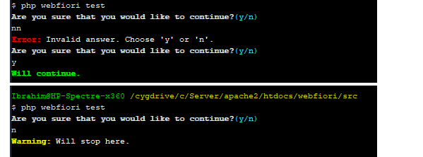
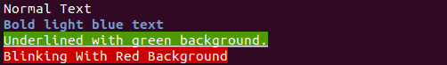
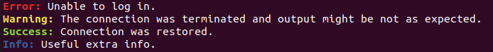

# Command Line Interface

<meta name="description" content="One of the features of the framework is the ability to run it as a command line application using terminals. Learn about the functionality which is provided by the CLI of the framework.">

In this page:
* [Introduction](#introduction)
* [Setup](#setup)
* [Running Commands](#running-commands)
* [Implementing CLI Commands](#implementing-cli-commands)
  * [Extending The Class "CLICommand"](#extending-the-class-clicommand)
  * [Registering the Command](#registering-the-command)
  * [Running The Command](#running-the-command)
* [Using Command Line Arguments](#using-command-line-arguments)
* [Reading User Input](#reading-user-input)
   * [Prompt](#prompt)
   * [Confirm](#confirm)
   * [Multiple Choice](#multiple-choice)
* [Coloring Output](#coloring-output)

## Introduction
One of the features of the framework is the ability to run it as a command line application using terminal. This can be useful if the server that the application is deployed in have SSH access. The command line interface of the framework has a limit functionality but the developer can extend it by creating custom commands.

After completing the next set of tutorials, the developer should be able to use the framework using CLI. Also, he should be able to create his own custom commands and run them.

## Setup
Depending on the operating system that will be in use, the execution way may differ. But there is one thing which is common. The first thing is that we must know where PHP interpreter is installed. After that, the folder that contain the executable must be added to `PATH` environment variable. This situation is applicable to Windows OS.

If a WebFiori application based is created and the developer is inside project folder, the following output would be seen when running the command `php webfiori`:

``` bash
$ php webfiori                                                                                                                       
|\                /|
| \      /\      / |              |  / \  |
\  \    /  \    /  / __________   |\/   \/|
 \  \  /    \  /  / /  /______ /  | \/ \/ |
  \  \/  /\  \/  / /  /           |  \ /  |
   \    /  \    / /  /______      |\  |  /|
    \  /    \  / /  /______ /       \ | /
     \/  /\  \/ /  /                  |
      \ /  \ / /  /                   |
       ______ /__/                    |
WebFiori Framework  (c) Version 3.0.0-RC3 Beta


Usage:
    command [arg1 arg2="val" arg3...]

Global Arguments:
    --ansi:[Optional] Force the use of ANSI output.
Available Commands:
    help:                Display CLI Help. To display help for specific command, use the argument "--command-name" with this command.
    v:                   Display framework version info.
    show-settings:       Display application configuration.
    cron:                Run CRON Scheduler.
    create:              Creates a system entity (middleware, web service, background process ...).
    add:                 Add a database connection or SMTP account.
    list-routes:         List all created routes and which resource they point to.
    list-themes:         List all registered themes.
    run-query:           Execute SQL query on specific database.
    update-settings:     Update application settings which are stored in the class "AppConfig".
    update-table:        Update a database table.
```

Once this output appears, it means everything is ready to use the framework in terminal.
 
## Running Commands

In order to run a command, the developer must understand the structure of each command.

The overall format of any command in the framework is this: `command-name [arg1 arg2="something" arg3...]`. This format means that every command in the framework consist of the following parts:

* Command name (the `command-name` part).
* Zero or more arguments (the `[arg1 arg2="something" arg3...]`).

The name of the command is usually something like `help` or `h`. The arguments usually come after the name of the command. Some commands does not have arguments and some do. In addition, a command can have optional arguments and mandatory ones.

One of the commands that the framework supports is the command `help`. When trying to run it without any arguments, the developer should see the following output:

```
$ php webfiori help                                                                                                           
WebFiori Framework  (c) Version 3.0.0-RC3 Beta


Usage:
    command [arg1 arg2="val" arg3...]

Global Arguments:
    --ansi:[Optional] Force the use of ANSI output.
Available Commands:
    help:                Display CLI Help. To display help for specific command, use the argument "--command-name" with this command.
    v:                   Display framework version info.
    show-settings:       Display application configuration.
    cron:                Run CRON Scheduler.
    create:              Creates a system entity (middleware, web service, background process ...).
    add:                 Add a database connection or SMTP account.
    list-routes:         List all created routes and which resource they point to.
    list-themes:         List all registered themes.
    run-query:           Execute SQL query on specific database.
    update-settings:     Update application settings which are stored in the class "AppConfig".
    update-table:        Update a database table.
```

From the help, it can be noticed that the help supports one argument and the name of the argument is `--command-name`. This argument is used to show help for a specific command. For example, if developer would like to show the help for the command `cron`, then he can do it as follows:

```
$ php webfiori help --command-name=cron                
    cron:                Run CRON Scheduler.
    Supported Arguments:
                            p:[Optional] CRON password. If it is set in CRON, then it must be provided here.
                       --list:[Optional] List all scheduled CRON jobs.
                      --check:[Optional] Run a check aginst all jobs to check if it is time to execute them or not.
                      --force:[Optional] Force a specific job to execute.
                   --job-name:[Optional] The name of the job that will be forced to execute or to show its arguments.
              --show-job-args:[Optional] If this one is provided with job name and a job has custom execution args, they will be shown.
                   --show-log:[Optional] If set, execution log will be shown after execution is completed.
```

## Implementing CLI Commands

One of the features of the framework is that it allow developers to extend the functionality which is provided by CLI engine of the framework by creating their own custom commands. Creating new one is very simple. It involves the following steps:

* Creating new PHP class that extends the class [`CLICommand`](https://webfiori.com/docs/webfiori/cli/CLICommand)
* Implementing the abstract method [`CLICommand::exec()`](https://webfiori.com/docs/webfiori/cli/CLICommand#exec).
* Register the command.

The last setup must be performed if the command class is created outside the folder `[APP_DIR]/commands`. If the command is created inside that folder, it will be auto-registered.

### Extending The Class "CLICommand"

The first step in creating new command is to create new PHP class and make the class a child of the class [`CLICommand`](https://webfiori.com/docs/webfiori/cli/CLICommand). It can be noticed that the constructor of the class takes 3 parameters. The first one is the name of the command, the second one is an array of arguments and the last one is a description of the command. 

The name of the command is a string which will be used to call it from the terminal. The arguments represented as an array that contains sub associative arrays. The arguments also can be objects of type [`CommandArgument`](https://webfiori.com/docs/webfiori/cli/CommandArgument). The description of the command is a string that will be shown when the command `help` is executed.

Suppose that a developer would like to implement a command that takes the name of a person from the terminal as an input and display the string "Hi '{name}'". Assuming that the name of the command is `say-hi`. The command that will be created will be in the folder `app/commands`. The following code snippet shows how this command is created.

``` php
<?php

namespace app\commands;

use webfiori\cli\CLICommand;

class SayHiCommand extends CLICommand {
    
    public function __construct() {
        parent::__construct('say-hi', [], 'Takes a name as input and say "Hi".');
    }
    
    public function exec() {
        $name = $this->getInput('Give me your name:');
        $this->println("Hi $name");
        return 0;
    }

}

```
The method [`CLICommand::getInput()`](https://webfiori.com/docs/webfiori/cli/CLICommand#getInput) is used to read user input from an [`InputStream`](https://webfiori.com/docs/webfiori/cli/InputStream). The default input stream is represented by the class [`StdIn`](https://webfiori.com/docs/webfiori/cli/StdIn). The method accepts 3 parameters but for now, only the first one will be used. The first parameter of the method is a prompt text that will be shown to the user. The text is used to specify what the developer would like to get from the user.

The method [`CLICommand::println()`](https://webfiori.com/docs/webfiori/cli/CLICommand#println) is used to show output. It will send it directly to [`OutputStream`](https://webfiori.com/docs//webfiori/cli/OutputStream). The default output stream is represented by the class [`StdOut`](https://webfiori.com/docs//webfiori/cli/StdOut).

### Registering the command

If the command is created inside the folder `[APP_DIR]/commands`, it will be registered automatically. But if the command is created somewhere else, it must be registered manually. To register any custom-created command, the class [`InitCommands`](https://github.com/WebFiori/app/blob/main/app/ini/InitCommands.php) can be used to complete this task. The class has one static method at which the developer can modify its body. The following code shows how to register new command.

``` php
namespace app\ini;

use webfiori\framework\WebFioriApp;

//first, import the command.
use app\commands\SayHiCommand;

class InitCliCommands {

    public static function init() {
        WebFioriApp::getRunner()->register(new SayHiCommand());
    }
}
```
### Running The Command

When the command `help` is executed, the newly created command will appear at the end of supported commands list as follows:
``` 
say-hi
        Takes a name as input and say "Hi".
```
When the command is executed, the output in the terminal will be similar to the one shown in next snippet.
```
$ php webfiori say-hi
Give me your name:
Ibrahim BinAlshikh
Hi Ibrahim BinAlshikh
```
## Using Command Line Arguments

Usually, a command can have arguments which are passed to it when it is called. Some arguments can be optional and some are not. In addition to that, some arguments might work as an options. If added, they will make the command behave in different way based on its implementation.

Adding support for arguments to a command can be archived in 3 ways:
* Supply the arguments to the constructor of the class [`CLICommand`](https://webfiori.com/docs/webfiori/cli/CLICommand#__construct).
* Using the method [`CLICommand::addArgs()`](https://webfiori.com/docs/webfiori/cli/CLICommand#addArgs) to add multiple args at once.
* Using the method [`CLICommand::addArg()`](https://webfiori.com/docs/webfiori/cli/CLICommand#addArg) to add one argument.
* Using the method [`CLICommand::addArgument()`](https://webfiori.com/docs/webfiori/cli/CLICommand#addArgument) to add one argument as object of type [`CommandArgument`](https://webfiori.com/docs/webfiori/cli/CommandArgument).

Assuming that the developer would like to add two arguments to the command `SayHiCommand`, `--name` and `--email`. If the name is not provided, will simply read it when the job starts to execute.

``` php
<?php

namespace app\commands;

use webfiori\cli\CLICommand;

class SayHiCommand extends CLICommand{
    
    public function __construct() {
        parent::__construct('say-hi', [
            '--name' => [
                'optional' => true
            ],
            '--email' => [
                'optional' => true
            ]
        ], 'Takes a name as input and say "Hi".');
    }
    
    public function exec() {
        $name = $this->getArgValue('--name');
        
        if ($name === null) {
            $name = $this->getInput('Give me your name:');
        }
        $email = $this->getArgValue('--email');
        $this->println("Hi $name");
        
        if ($email === null) {
            $this->warning('Email is not provided.');
        } else {
            $this->println("Email address: $email");
        }
        return 0;
    }
}
```

There are 3 possibilities when executing the command `SayHiCommand`, one is that everything is provided as arguments, the second is only the `--name` argument is provided and the last is to have none. The next output will be shown when running the command with all arguments.
```
$ php webfiori say-hi --name="Ibrahim" --email="example@mydomain.com"
Hi Ibrahim
Email address: example@mydomain.com
```

The next output will be shown when running the command with the argument `--name` is set and the argument `--email` is missing.
```
$ php webfiori say-hi --name="Ibrahim"                                                                         
Hi Ibrahim
Warning: Email is not provided.
```

It can be noticed that the statement which was shown by the method [`CLICommand::warning()`](https://webfiori.com/docs/webfiori/cli/CLICommand#warning) is pre-formatted. It is one of the methods which is used to format the output automatically.

The next output will be shown when running the command without providing any arguments.

```
$ php webfiori say-hi                                                                                          
Give me your name:
Ibrahim Ali
Hi Ibrahim Ali
Warning: Email is not provided.
```
## Reading User Input

One of the methods which is used to read user input is the method [`CLICommand::getInput()`](https://webfiori.com/docs/webfiori/cli/CLICommand#getInput). The framework provides the developers with the most commonly used helper inputs like asking a question or asking the user to select one of multiple options. 

### Prompt

Prompt is used to read any type of user input. The method [`CLICommand::getInput()`](https://webfiori.com/docs/webfiori/framework/cli/CLICommand#getInput) is used to perform that task. The method accepts 3 parameters. The first one is the text that will be shown to the user. The second one is a default value which will be used when the user hit "Enter" without typing anything. The last one is a closure (a function) which can be used to validate user input.

The following code snippet shows how to get user input as prompt.

``` php
$userInput = $this->getInput('Give me your name:');
$this->println("Your name is: $userInput");
```

The following code snippet shows how to use default values with prompt in addition to using a validation function. The closure must return a boolean value. If it returns `true`, then it means the value is valid. If `false` is returned, it means the given value is invalid and the method will ask the user to enter new value again.

In the following case, the default value will be "Orange". 

``` php
$userInput = $this->getInput('Enter a fruit name:', 'Orange', function ($userInput){
    $allowedVals = ['Apple','Orange','Lemon'];
    if (in_array($userInput, $allowedVals) {
        return true;
    }
    return false;
});
$this->println("Fruit name: $userInput");
```

### Confirm

The method [`CLICommand::confirm()`](https://webfiori.com/docs/webfiori/cli/CLICommand#confirm) is used to ask the user question which can have two answers only, yes or no. The method have two parameters. The first one is the text that will be shown in the console and the second is a boolean that represents default value if the user hit "Enter" without specifying an answer. The method will return `true` if the answer was "yes" and `false` if the answer is "no". The default answer will appear in upper case in terminal if specified.

To submit an answer, the user have to type n for "no" or y for "yes" in the console and hit "Enter". Note that if the user submitted any other answer, the method will keep asking till he submits one of the two answers.

The following code sample shows how to use this method.

```
if ($this->confirm('Are you sure that you would like to continue?')) {
    $this->success('Will continue.');
} else {
    $this->warning('Will stop here.');
}
```

The following image shows the output of the command when executed.



### Multiple Choice

A multiple choice input is a way to make the user select one option of multiple options. The method [`CLICommand::select()`](https://webfiori.com/docs/webfiori/cli/CLICommand#select) is used to show the question and the possible choices. The method accepts 3 parameters. The first one is the text that will be shown to the user. The second one is the array that contains the choices at which the user will select from. The last parameter is an optional default value to use in case the user hit "Enter" without selecting any choice (answer index). The user can select an answer by supplying its number as an input or the full text of the choice.

The following code sample shows how to use it by asking a simple question.

``` php
$choices = [
    'PHP',
    'JavaScript',
    'C++','HTML',
    'C#'
];
$answer = $this->select('Which of the following is not a programming language?', $choices);

if ($answer == 'HTML') {
    $this->success('Correct Answer');
} else {
    $this->error('Wrong answer.');
}
```

## Coloring Output

One of the things that programmers like are the colors which appear in any terminal. In addition to making the output looks nice, colors can be used as an indicator for warnings or errors during execution. The framework supports output formatting using colors if the method [`CLICommand::println()`](https://webfiori.com/docs/webfiori/cli/CLICommand#println) or the method [`CLICommand::prints()`](https://webfiori.com/docs/webfiori/cli/CLICommand#prints) is used. In addition to that, it is possible to format a string using ANSI escape sequences using the static method [`CLICommand::formatOutput()`](https://webfiori.com/docs/webfiori/framework/cli/CLICommand#formatOutput). The way to format the output will be the same for the 3 methods.

>> Note: Output formatting is disabled by default. To enabled it, the argument `--ansi` must be provided.

Formatting output is very simple. The method [`CLICommand::prints()`](https://webfiori.com/docs/webfiori/framework/cli/CLICommand#prints) takes two parameters, the first one is the output value and the second one is an associative array of formatting options. If the developer would like to output ANSI formatted text, simply he must supply the second argument. In order to change the color of the output, we must set the value of the index `color` color to the color that we would like to use.

``` php 
$this->prints('This is a red text ', [
    'color' => 'red'
]);
$this->prints(', this is blue text ', [
    'color' => 'blue'
]);
$this->prints('and this is green text ', [
    'color' => 'green'
]);
```


In addition to changing the color of the output, it is possible to set the background color of the text by adding the index bg-color. Also, the array can have the following text formatting options added as booleans:
* `bold`: Make output bold.
* `underline`: Make output underlined.
* `blink`: Make the output blink.
* `reverse`: Reverse output colors (make background color become the text color and vice versa).

The following code snippets uses the method `CLICommand::println()` to show the output. 

``` php
$this->println("Normal Text");

$this->println("Bold light blue text", [
    'color' => 'light-blue',
    'bold' => true
]);

$this->println("%s", "Underlined with green background.", [
    'bg-color' => 'green',
    'underline' => true
]);

$this->println("%s", "Blinking With Red Background", [
    'bg-color' => 'red',
    'blink' => true
]);

```




### Pre-made Methods For Output Formatting

The class [`CLICommand`](https://webfiori.com/docs/webfiori/cli/CLICommand) provides the developer with methods which can be used to display the output formatted without using formatting options. The methods can be used to show output for repeated tasks. The methods are:
* [`CLICommand::error()`](https://webfiori.com/docs/webfiori/cli/CLICommand#error): Output a message that represents an error.
* [`CLICommand::info()`](https://webfiori.com/docs/webfiori/cli/CLICommand#info): Output a message that represents extra information().
* [`CLICommand::success()`](https://webfiori.com/docs/webfiori/cli/CLICommand#success): Output a message that represents success state.
* [`CLICommand::warning()`](https://webfiori.com/docs/webfiori/cli/CLICommand#warning): Output a message that represents a warning.

``` php
$this->error('Unable to log in.');
$this->warning('The connection was terminated and output might be not as expected.');
$this->success('Connection was restored.');
$this->info('Useful extra info.');
```




**Next: [Sessions Management](learn/sessions-management)**

**Previous: [Sending Emails](learn/sending-emails)**
