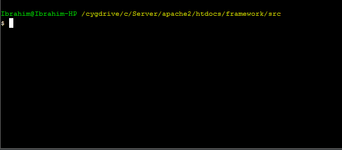
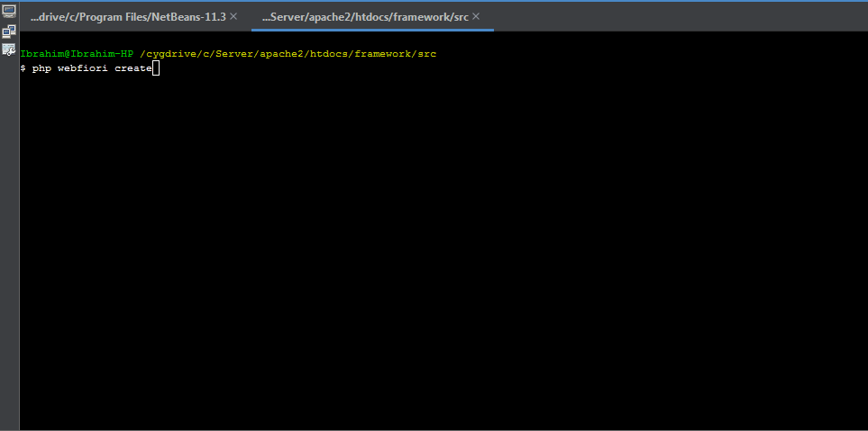
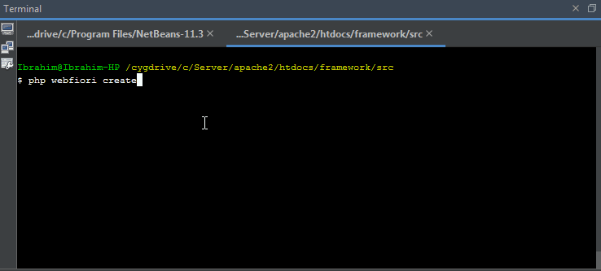
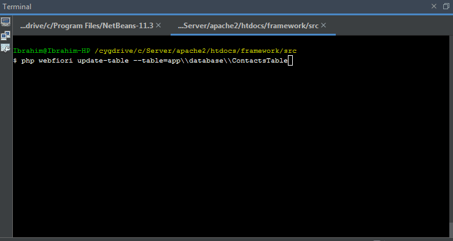

# Database

<meta name="description" content="Learn how to use the database abstraction layer of the framework.">

In this page:
* [Introduction](#introduction)
* [The Idea](#the-idea)
* [Initializing your Database](#initializing-your-database)
  * [Adding Connection Information](#adding-connection-information)
  * [Creating Database Tables](#creating-database-tables)
  * [Creating Database Class](#creating-database-class)
* [Database Queries](#database-queries)
  * [Insert Record](#insert-record)
  * [Update Record](#update-record)
  * [Delete Record](#delete-record)
  * [Select](#select)
  * [Joins](#joins)
  * [Unions](#unions)
  * []()
* [Working With Result Set](#working-with-result-set)
  * [Retrieving Records](#retrieving-records)
  * [Mapping Records to Objects](#mapping-records-to-objects)
* [Command Line Utilities](#command-line-utilities)
  * [Adding Connection](#adding-connection)
  * [Creating Database Table](#creating-database-table)
  * [Initializing Database Table](#initializing-database-table)
  * [Modifying Database Table](#modifying-database-table)

## Introduction

One of the important features of any web application is to have a simple-unified interface at which the developer can use to access application database. WebFiori framework has an abstract layer that provides the developer with all needed tools to create databases and performs queries on them. Currently, the abstraction layer supports MySQL and MSSQL database but there are plans to support more in the future.

> **Note:** It is possible to connect to any database using PDO driver of PHP. The database layer helps in defining your database in easy way and also it helps in making the process of building SQL queries much simpler task.

## The Idea

Each table in your database is represented by the class [`Table`](https://webfiori.com/docs/webfiori/database/Table). Every table consist of columns and every column is represented by the class [`Column`](https://webfiori.com/docs/webfiori/database/Column). Each table must be part of a schema (or database). The database is represented by the class [`Database`](https://webfiori.com/docs/webfiori/database/Database). WebFiori framework has the class [`DB`](https://webfiori.com/docs/webfiori/framework/DB) which adds extra functionality to the class [`Database`](https://webfiori.com/docs/webfiori/database/Database). The database instance is used to connect to database and run queries on it. 

In case of MySQL database, database tables represented by the class [`MySQLTable`](https://webfiori.com/docs/webfiori/database/mysql/MySQLTable) and table columns represented by the class [`MySQLColumn`](https://webfiori.com/docs/webfiori/database/mysql/MySQLColumn). In case of MSSQL, database tables represented by the class [`MSSQLTable`](https://webfiori.com/docs/webfiori/database/mssql/MSSQLTable) and table columns represented by the class [`MSSQLColumn`](https://webfiori.com/docs/webfiori/database/mssql/MSSQLColumn). 

## Initializing your Database

The following set of steps will show you how to create your database structure and connect to the database and execute queries. Overall, there are 3 steps in the process:
* Adding connection information.
* Creating database tables as classes.
* Creating a class that acts as the database schema and adding tables to it.

### Adding Connection Information

Database connections are represented by the class [`ConnectionInfo`](https://webfiori.com/docs/webfiori/database/ConnectionInfo). Connection information are stored inside the class [`AppConfig`](https://github.com/WebFiori/app/blob/main/app/AppConfig.php#L465). It is possible to store multiple connecion in it. There are two ways to add connection information. The first one is to add it manually or adding it using command line interface.

Adding connection information manually is simple. The developer have to edit the code inside the method [`AppConfig::initDbConnections()`](https://github.com/WebFiori/app/blob/main/app/AppConfig.php#L465). Assuming that we have MySQL database with the name `testing_db` and username `root` and password `123456`, then connection can be added as follows:

``` php
private function initDbConnections() {() {
    $this->dbConnections = [
        'connection-00' => new ConnectionInfo('mysql', 'root', '12345', 'testing_db', 'loalhost', 3306, [
            'connection-name' => 'connection-00'
        ])
    ];
}
```

The connection information is added inside the array `$dbConnections`. This array can have any number of connections. The key in the array represents connection name (`connection-00` in this example) and the value is an object of type [`ConnectionInfo`](https://webfiori.com/docs/webfiori/database/ConnectionInfo). Note that connection name will be used later to connect to the database.

### Creating Database Tables

MySQL Database tables represented by the class [`MySQLTable`](https://webfiori.com/docs/webfiori/database/mysql/MySQLTable). Each table in the database must be represented as a sub class of this class. There are two ways at which the developer can create a class that represent a database table. One is a manual way and the other one is to use command line interface.

To create a table class manually, developer have to create new class that extend the class [`MySQLTable`](https://webfiori.com/docs/webfiori/database/mysql/MySQLTable) and add columns to it as needed. Assuming that the developer would like to place database tables in the folder `app/database` with namespace `app\database`. Also, assuming that the developer would like to create a table for keeping contacts information. 

The [constructor](https://webfiori.com/docs/webfiori/database/mysql/MySQLTable#__construct) of the class accepts one parameter which is the name of the table as it appears in the database. Let's assume that the name of the table is `contacts`.

``` php 
namespace app\database;

use webfiori\database\mysql\MySQLTable;

class ContactsTable extends MySQLTable {
    public function __construct() {
        parent::__construct('contacts');
    }
}

```

After setting the name of the table, developer can start by adding columns to the table. There is more than one way to add columns to the table. The method [`MySQLTable::addColumns()`](https://webfiori.com/docs/webfiori/database/mysql/MySQLTable#addColumns) can be used to add multiple columns at once. The method accepts an associative array. The indices of the array are columns names and the value of each index is a sub associative array that holds column properties. 

``` php
namespace app\database;

use webfiori\database\mysql\MySQLTable;

class ContactsTable extends MySQLTable {
    public function __construct() {
        parent::__construct('contacts');
        
        $this->addColumns([
            'name' => [
                'type' => 'varchar',
                'size' => 50,
                'primary' => true
            ],
            'age' => [
                'type' => 'int',
                'size' => 3,
            ],
            'mobile' => [
                'type' => 'varchar',
                'size' => 10,
                'is-null' => true
            ],
            'phone' => [
                'type' => 'varchar',
                'size' => 10,
                'is-null' => true
            ],
            'email' => [
                'type' => 'varchar',
                'size' => 255,
                'is-null' => true
            ]
        ]);
    }
}

```

This table will be used to store basic information about contacts. It will act as an interface between the application and the actual database table.

### Creating Database Class

After creating tables as classes, developer have to add them to an instance of the class [`Database`](https://webfiori.com/docs/webfiori/database/Database) which represents the actual database instance. WebFiori framework have the class [`DB`](https://webfiori.com/docs/webfiori/framework/DB) which adds extra functionality like the ability to automatically register multiple tables automatically. For this reason,the developer should use the class [`DB`](https://webfiori.com/docs/webfiori/framework/DB). Assuming that the name of the database class is  `TestingDatabase`.

``` php
namespace app\database;

use webfiori\framework\DB;

class TestingDatabase extends DB {
    public function __construct() {
        parent::__construct('connection-00');
        
    }
}
```
The constructor of the class accepts one parameter which is the name of the connection that will be used by database instance. After that, database table classes must be registered in order to perform queries on them. To do that, the developer can use the method [`DB::addTable()`](https://webfiori.com/docs/webfiori/framework/DB#addTable) for registering single table or the method [`DB::register()`](https://webfiori.com/docs/webfiori/framework/DB#register) to add multiple tables which belongs to same namespace.


``` php
namespace app\database;

use webfiori\framework\DB;
use app\database\ContactsTable;

class TestingDatabase extends DB {
    public function __construct() {
        parent::__construct('connection-00');
        
        $this->addTable(new ContactsTable());
    }
}
```

Now that the table is added, we can create an instance of the class `TestingDatabase` and start building queries as needed.

## Database Queries

The library provides a query builder which can be used to build almost any type of query. All query builders extend the class [AbstractQuery](https://webfiori.com/docs/webfiori/database/AbstractQuery) which acts as a base query builder. It has many methods to support the process of building queries. Note that the class [`Database`](https://webfiori.com/docs/webfiori/database/Database) acts as an interface for this class. To get the query builder instance, use the method [`Database::getQueryGenerator()`](https://webfiori.com/docs/webfiori/database/Database#getQueryGenerator).

### Insert Record

The method [AbstractQuery::insert()](https://webfiori.com/docs/webfiori/database/AbstractQuery#insert) is used to build an insert query for MySQL and MSSQL database. The following code sample shows how to use that method to create an insert query in case of MySQL database. It is used in same way in case of MSSQL.

``` php

$db = new TestingDatabase();
$db->table('contacts')->insert([
    'name' => 'Ibrahim BinAlshikh',
    'age' => 27,
    'mobile' => '+966554321000',
    'phone' => '+966136543456',
    'email' => 'xyz@example.com'
]);

// insert into `contacts` (`name`, `age`, `mobile`, `phone`, `email`) values ('Ibrahim BinAlshikh', 27, '+966554321000', '+966136543456', 'xyz@example.com');
```

It is possible to insert multiple records using one insert call as follows:

``` php 
$db->table('contacts')->insert([
    'cols' => ['name', 'age', 'mobile', 'phone', 'email'],
    'values' => [
        ['Contact 1', 33, '055434323', '0137665765', '123@example.com'],
        ['Contact 2', 22, '056246436', '0138732156', '1234@example.com'],
        ['Contact 3', 48, '051297647', '0136523489', '12345@example.com']
    ]
]);

// insert into `contacts`
// (`name`, `age`, `mobile`, `phone`, `email`)
// values
// ('Contact 1', 33, '055434323', '0137665765', '123@example.com'),
// ('Contact 2', 22, '056246436', '0138732156', '1234@example.com'),
// ('Contact 3', 48, '051297647', '0136523489', '12345@example.com');
```

### Update Record

The method [AbstractQuery::update()](https://webfiori.com/docs/webfiori/database/AbstractQuery#update) is used to build delete record query for MySQL and MSSQL database. The following code sample shows how to use that method to create an update record query with a condition.

``` php
$db = new TestingDatabase();
$db->table('contacts')->update([
    'age' => 44,
    'email' => 'new-email@exmple.com'
])->where('name', '=', 'Contact 1');

// update `contacts` set `age` = 44, set `email` = 'new-email@exmple.com' where `contacts`.`name` = 'Contact 1'
```

### Delete Record

The method [AbstractQuery::delete()](https://webfiori.com/docs/webfiori/database/AbstractQuery#delete) is used to build a delete record query for MySQL and MSSQL database. The following code sample shows how to use that method to create a drop record query with a condition.

``` php
$db = new TestingDatabase();

$db->table('contacts')->delete()->where('name', '=', 'Contact 1');

// delete from `contacts` where `contacts`.`name` = 'Contact 1'
```

### Select
The method [AbstractQuery::select()](https://webfiori.com/docs/webfiori/database/AbstractQuery#select) is used to build a `select` query.

``` php

$db = new TestingDatabase();
$db->table('contacts')->select();

// select * from `contacts`
```
> **Note:** After building the query, the method [`Database::execute()`](https://webfiori.com/docs/webfiori/database/Database#execute) or the method [`AbstractQuery::execute()`](https://webfiori.com/docs/webfiori/database/AbstractQuery#execute) must be called to run the query on the database.

The method [`Database::table()`](https://webfiori.com/docs/webfiori/database/Database#table) is used to specify the table at which the query will be based on. It is possible to select some columns by supplying an array that holds columns that will be selected.

``` php

$db = new TestingDatabase();
$db->table('contacts')->select(['name', 'age']);

// select `name`, `age` from `contacts`
```

Also, it is possible to give an alias for the column using the following syntax.


``` php

$db = new TestingDatabase();
$db->table('contacts')->select([
    'name' => 'full_name', 
    'age' => 'contact_age'
    ]);

// select `name` as `full_name`, `age` as `contact_age` from `contacts`
```

Developer can also add a `where` condition to the query. There are 3 methods which can be used to add a where condition:
* [AbstractQuery::where()](https://webfiori.com/docs/webfiori/database/AbstractQuery#where)
* [AbstractQuery::orWhere()](https://webfiori.com/docs/webfiori/database/AbstractQuery#orWhere)
* [AbstractQuery::andWhere()](https://webfiori.com/docs/webfiori/database/AbstractQuery#andWhere)

``` php

$db = new TestingDatabase();
$db->table('contacts')->select()->where('age', '>', 15)
                                ->andWhere('name', '=', 'Ibrahim');

// select * from `contacts` where `age` > 15 and `name` = 'Ibrahim'
```
### Joins

### Unions

## Working With Result Set
After building the query, it must be executed on the database. To execute a query, the method [`AbstractQuery::execute()`](https://webfiori.com/docs/webfiori/database/AbstractQuery#execute) can be used. Some queries will not return a result but in case of select query, there will be. This section explains how to work with database query results.

### Retrieving Records

To get query result, the method [`Database::getLastResultSet()`](https://webfiori.com/docs/webfiori/database/Database#getLastResultSet) can be used. This method will return an object of type [`ResultSet`](https://webfiori.com/docs/webfiori/database/ResultSet). 

``` php 

$db = TestingDatabase();
$db->table('contacts')->select()->execute();
$result = $db->getLastResultSet();

foreach($result as $record) {
   //Do something with the record
}
```

The variable `$record` in the given example will be an associative array. The indices of the array are columns names as they appear in database.

### Mapping Records to Objects

It is possible to map the records to objects. To achieve this, the developer can use the method [`ResultSet:: setMappingFunction()`](https://webfiori.com/docs/webfiori/database/ResultSet#setMappingFunction). This method is used to set a function which can use to manipulate the result set after fetching. The method must return an array that contains the records after mapping.

``` php
$db = TestingDatabase();
$db->table('contacts')->select()->execute();
$result = $db->getLastResultSet();

$result->setMappingFunction(function ($dataset){
    $retVal = [];
    foreach($dataset as $record) {
        $contactObj = new Contact();
        $contactObj->setName($record['name']);
        $contactObj->setAge($record['age']);
        $contactObj->setMobile($record['mobile']);
        $contactObj->setPhone($record['phone']);
        $contactObj->setEmail($record['email']);
        
        $retVal[] = $contactObj;
    }
    return $retVal;
});


foreach($result as $record) {
   //Now the $record is an object of type Contact
}

```


## Command Line Utilities

WebFiori framework provides extra commands using CLI which are related to database management. The commands can be used to automate some of the repetitive tasks such as creating new database table. In this section, you will find a summary about the available commands.

### Adding Connection Using Command Line Interface

This way of adding database connections is recommended since connection information will be first validated before stored. To add new connection, simply run the command `add` as follows: `php webfiori add`. When the command is executed, a menu that has options will appear. The following image shows the whole process of adding the connection using CLI.



### Creating Database Table

It is recommended to use command line interface in creating table classes. By using CLI, you only have to give database table properties as inputs and the class will be created automatically for you. To create a new database table class, simply run the command `php webfiori create` and select the desired option from the menu.



### Initializing Database Table

The command `php webfiori create` can be also used to initialize the table in database by selecting another option. 



### Modifying Database Table

The command `php webfiori update-table` is used to modify the structure of the table. This command accepts one argument that has the name `--table`. The value of the argument must be the name of the table class including its namespace. 



**Next: [The Library WebFiori JSON](learn/webfiori-json)**

**Previous: [Web Services](learn/web-services)**
