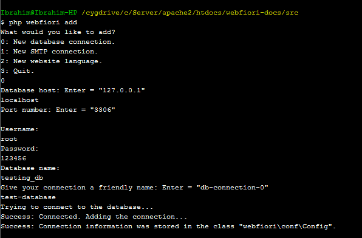

# Database

<meta name="description" content="Learn how to use the database abstraction layer of the framework.">

In this page:
* [Introduction](#introduction)
* [The Idea](#the-idea)
* [Initializing your Database](#initializing-your-database)
  * [Adding Connection Information](#adding-connection-information)
  * [Creating Database Tables](#creating-database-tables)
  * [Creating Database Class](#creating-database-class)
* [Command Line Utilities](#command-line-utilities)
  * [Adding Connection](#adding-connection)
  * [Creating Database Table](#creating-database-table)

## Introduction

One of the important features of any web application is to have a simple-unified interface at which the developer can use to access application database. WebFiori framework has an abstract layer that provides the developer with all needed tools to create databases and performs queries on them. Currently, the abstraction layer supportes only MySQL database but there are plans to support more in the future.

> **Note:** It is possible to connect to any database using PDO driver of PHP. The database layer helps in defining your database in easy way and also it helps in making the process of building SQL queries much simpler task.

## The Idea

Each table in your MySQL database is represented by the class [`MySQLTable`](https://webfiori.com/docs/webfiori/database/mysql/MySQLTable). Every table consist of columns. Every column is represented by the class [`MySQLColumn`](https://webfiori.com/docs/webfiori/database/mysql/MySQLColumn). Each table must be part of a schema (or database). The database is represented by the class [`Database`](https://webfiori.com/docs/webfiori/database/Database). WebFiori framework has the class [`DB`](https://webfiori.com/docs/webfiori/framework/DB) which adds extra functionality to the class [`Database`](https://webfiori.com/docs/webfiori/database/Database). The database instance is used to connect to MySQL database and run queries on it. 

## Initializing your Database

The following set of steps will show you how to create your database structure and connect to the database and execute queries. Overall, there are x steps in the process:
* Adding connection information.
* Creating database tables as classes.
* Creating a class that acts as the actual database and adding tables to it.

### Adding Connection Information

Database connections are represented by the class [`ConnectionInfo`](https://webfiori.com/docs/webfiori/database/ConnectionInfo). Connection information is stored inside the class [`Config`](https://webfiori.com/docs/webfiori/conf/Config). It is possible to store multiple connecion inside it. There are two ways to add connection information. The first one is to add it manually to the class [`Config`](https://webfiori.com/docs/webfiori/conf/Config). The second way is to use command line interface.

Adding connection information manually is simple. All what we have to do is to edit the code in the constructor of the class [`Config`](https://webfiori.com/docs/webfiori/conf/Config). Assuming that we have MySQL database with the name `testing_db` and username `root` and password `123456`, then the connection can be added as follows:

``` php
/**
  * Initialize configuration.
  */
private function __construct() {
    $this->releaseDate = '2020-07-05';
    $this->version = '1.1.0';
    $this->versionType = 'Beta 3';
    $this->configVision = '1.3.5';
    $this->dbConnections = [
        'connection-00' => new ConnectionInfo('mysql', 'root', '12345', 'testing_db', 'loalhost', 3306)
    ];
}
```

The connection information is added inside the array `$dbConnections`. This array can have any number of connections. The index in the array represents connection name (`connection-00` in this example) and the value is an object of type [`ConnectionInfo`](https://webfiori.com/docs/webfiori/database/ConnectionInfo). Note that connection name will be used later to connect to the database.



### Creating Database Tables

Database tables represented by the class [`MySQLTable`](https://webfiori.com/docs/webfiori/database/mysql/MySQLTable). Each table in the database must be represented as a sub class of this class. There are two ways at which the developer can create a class that represent a database table. One is manual way and the other one is to use command line interface.

To create a table class manually, we have to create new class that extend the class [`MySQLTable`](https://webfiori.com/docs/webfiori/database/mysql/MySQLTable) and add columns to it as needed. Let's assume that we would like to place our database tables in the folder `app/database` with namespace `app\database`. We will start by creating new PHP class. Let's assume that we would like to create a table for keeping contacts information. 

The [constructor](https://webfiori.com/docs/webfiori/database/mysql/MySQLTable#__construct) of the class accepts one parameter which is the name of the table as it appears in the database. Let's assume that the name of the table is `contacts`.

``` php 
namespace app\database;

use webfiori\database\mysql\MySQLTable;

class ContactsTable extends MySQLTable {
    public function __construct() {
        parent::__construct('contacts');
    }
}

```

After setting the name of the table, we can start by adding columns to the table. There is more than one way to add columns to the table but we will be looking at the easist way. The method [`MySQLTable::addColumns()`](https://webfiori.com/docs/webfiori/database/mysql/MySQLTable#addColumns) can be used to add multiple columns at once. The method accepts an associative array. The indices of the array are columns names and the value of each index is a sub associative array that holds column properties. 

``` php
namespace app\database;

use webfiori\database\mysql\MySQLTable;

class ContactsTable extends MySQLTable {
    public function __construct() {
        parent::__construct('contacts');
        
        $this->addColumns([
            'name' => [
                'type' => 'varchar',
                'size' => 50,
                'primary' => true
            ],
            'age' => [
                'type' => 'int',
                'size' => 3,
            ],
            'mobile' => [
                'type' => 'varchar',
                'size' => 10,
                'is-null' => true
            ],
            'phone' => [
                'type' => 'varchar',
                'size' => 10,
                'is-null' => true
            ],
            'email' => [
                'type' => 'varchar',
                'size' => 255,
                'is-null' => true
            ]
        ]);
    }
}

```

This table will be used to store basic information about contacts. We will look at how to actually create the table in the database later on.

### Creating Database Class

After creating tables as classes, we have to add them to an instance of the class [`Database`](https://webfiori.com/docs/webfiori/database/Database) which represents the actual database instance. WebFiori framework extends this class by adding extra functionality. The class [`DB`](https://webfiori.com/docs/webfiori/framework/DB) will provide same functionality at which the class [`Database`](https://webfiori.com/docs/webfiori/database/Database) provides. For this reason, we will be extending the class [`DB`](https://webfiori.com/docs/webfiori/framework/DB). Let's create new class inside the folder `app/database` and give it the name `TestingDatabase`.

The constructor of the class accepts one parameter which is the name of the connection that will be used by database instance.

``` php
namespace app\database;

use webfiori\framework\DB;

class TestingDatabase extends DB {
    public function __construct() {
        parent::__construct('connection-00');
        
    }
}
```

After that, we will add the table that we created to the database. To do that, we use the method [`DB`](https://webfiori.com/docs/webfiori/database/Database#addTable).


``` php
namespace app\database;

use webfiori\framework\DB;
use app\database\ContactsTable;

class TestingDatabase extends DB {
    public function __construct() {
        parent::__construct('connection-00');
        
        $this->addTable(new ContactsTable());
    }
}
```

Now that we have the table added, we can create an instance of the class `ContactsTable` and start building queries as needed.

## Retrieving Results

After executing a select query in the database, we would like to get the result of the query. To get query result, the method [`Database::getLastResultSet()`](https://webfiori.com/docs/webfiori/database/Database#getLastResultSet). This metho will return an object of type [`ResultSet`](https://webfiori.com/docs/webfiori/database/ResultSet). 

``` php 

$db = TestingDatabase();
$db->table('contacts')->select()->execute();
$result = $db->getLastResultSet();

foreach($result as $record) {
   //Do something with the record
}
```

## Command Line Utilities

WebFiori framework provides extra commands using CLI which are related to database management. The commands can be used to automate some of the repetitive tasks such as creating new database table. In this section, you will find a summary about the available commands.

### Adding Connection Using Command Line Interface

This way of adding database connections is recommended since connection information will be first validated before stored. To add new connection, simply run the command `add` as follows: `php webfiori add`. When the command is executed, a menu that has options will appear. The following image shows the whole process of adding the connection using CLI.

### Creating Database Table

It is recomended to use command line interface in creating table classes. By using CLI, you only have to give database table properties as inputs and the class will be created automatically for you. To create a new database table class, simply run the command `php webfiori create` and select the desired option from the menu.
