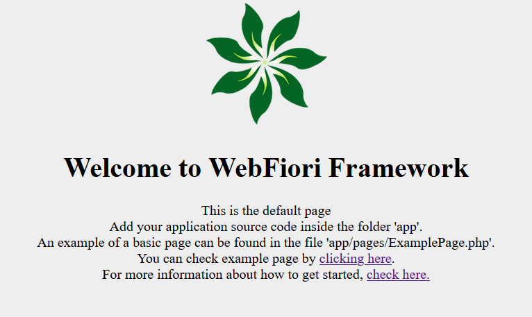

# Installation
In this page:
* [Requirements](#requirements)
  * [General Requirements](#general-requirements)
* [Setup Local Development Environment In Windows](#setup-local-development-environment-in-windows)
  * [Using WAMP Stack](#using-wamp-stack)
* [Installing The Framework](#installing-the-framework)
    * [Create Project Using Composer](#create-project-using-composer)
    * [Manual Installation](#manual-installation)

## Requirements

The following set of requirements must be met in order for the framework to work accordingly. Most of them are available with any AMP stack.

### General Requirements

* PHP >= 7.0
* mbstring PHP Extension
* mysqli PHP Extension (to connect to MySQL)
* sqlsrv PHP Extension (to connect MSSQL Server)
* [MSSQL Server PHP Extension](https://learn.microsoft.com/en-us/sql/connect/php/release-notes-php-sql-driver)
* json PHP Extension
* [Composer Dependency Manager](https://getcomposer.org/download/)

In addition to that, it would be great to have an IDE that can help in writing code and debugging. We recommend to use [Apache Netbeans IDE](https://netbeans.apache.org/).

## Setup Local Development Environment In Windows
For simple testing and development, it is possible to use the built-in server which comes with PHP. For production, it is always recommended to use server application such as Apache or IIS to run PHP.

### Using WAMP Stack
WAMP stands for "Windows, Apache, MySQL and PHP" it is a stack which includes all needed applications to start developing PHP applications. There are many WAMP stacks there. In our case, we will be using [Bitnami WAMP](https://bitnami.com/stack/wamp/installer). The download size is around 200MB. To download the latest version, [Check Here](https://bitnami.com/stack/wamp/installer).

Once downloaded, double click the downloaded file to start the installation process. The most important step is choosing the location at which the stack will be installed on. Choose a location like `C:\Server`. If this is the location, then PHP interpreter will be installed on `C:\Server\php`, Apache server on `C:\Server\apache2` and MySQL on `C:\Server\mysql`.

## Installing The Framework

There are 2 ways to install the framework:
* [Create Project Using Composer](#create-project-using-composer)
* [Manual Installation](#manual-installation)

### Create Project Using Composer

Assuming that composer is placed in the folder `C:\Server\apache2\htdocs`, the framework can be installed by creating a composer project which is based on the framework inside the same folder. To do that, simply open comand promte and run the following command:
``` bash
php composer.phar create-project webfiori/app my-site --prefer-dist
```
This command will create new folder which has the name `my-site` and install the framework with all its dependencies. The name of the folder can be changed as needed. Once this is finished, your workspace will be the folder `C:\Server\apache2\htdocs\my-site\app` which is the application source code folder. The last step is to set document root of the local development server to `C:\Server\apache2\htdocs\my-site\public` if you will test the application using Apache web server.

> <b>Note:</b> Add PHP to `PATH` in Windows in order to run it in terminal without having to type full path.

> <b>Note:</b> It is possible to rename application source code folder by changing the value of the constant `APP_DIR` in the top of the file `index.php`.

### Manual Installation

The other installation option is to download the framework from the official website and install it manually. Simply, go to [https://webfiori.com/download](https://webfiori.com/download) and download the latest release of the framework. Once downloaded, the files should be extracted to a sub-folder inside the folder `C:\Server\apache2\htdocs`. Assuming that the name of the folder is `my-site`, your workspace will be the folder `C:\Server\apache2\htdocs\my-site\app`. Also, document root will be `C:\Server\apache2\htdocs\my-site\public` in this case.

### Running The Project

There are two ways to start your website. The first one is to use PHP's built-in web server and the second one is to use Apache Web Server. The recomended way is to use Apache Web Server as this will make sure that your application is running using actual web server and .

#### Using Apache Web Server

Assuming that Bitnami Wamp Stack is installed, you need to update document root to point to your `public` folder. Document root is the location at which the server will send every request to. It showld always be the `public` folder for security reasons. To change document root, open the file `C:\Server\apache2\conf\bitnami\bitnami.conf` in Notepad or any text editor and change `DocumentRoot` to point to the public folder of the application (e.g. `C:\Server\apache2\htdocs\my-site\src\public`). Also, it is recomended to change every `C:\Server\apache2\htdocs` to point to the public folder in the same file. 

Once this step is finished, save the file and close it. After that, apache server must be restarted to apply the changes. The server can be restarted using server manager. To open server manager, go to the folder `C:\Server` and click the executable which has the name `manager-windows.exe`. Click on the tap "Manage Servers" and click on "Apache Server" and hit "Restart". 

Now when you open the web browser and navigate to `localhost`, a which is similar to the following image will appear.:



This means that local developent environment setup is finished.

#### Using PHP's Built-in Web Server

The built-in server is another way to run your application. It must be only used for testing. To run your application using built-in server, open command prompt and change directory to your application root (e.g. `my-site`). After that, run the command `php -S localhost:8080 -t public`. This will start the server at `localhost` port `8080`. Now when we open the web browser and navigate to `localhost:8080`, your application will open.


**Previous: [Introduction](learn/introduction)**

**Next: [Folder Structure](learn/folder-structure)**


