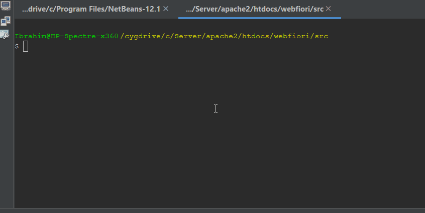

# Middleware
<meta name="description" content="Middleware is a way to filter HTTP request before it actually reach your application. You can think of it as a protection layer.">

In this page:
* [Introduction](#introduction)
* [The Class `AbstractMiddleware`](#the-class-abstractmiddleware)
* [Implementing Custom Middleware](#implementing-custom-middleware)
* [Assigning Middleware to Routes](#assigning-middleware-to-routes)
* [Middleware Groups](#middleware-groups)
* [Priority](#priority)
* [Command Line Utility](#command-line-utility)

## Introduction

Middleware can be used to filter requests before reaching your application. For example, we might have a middleware which is used to check if the user is authorized to use the application or not. If he is not, then the middleware may redirect the user to log in or send a response to tell him that he is not authorized. In addition to that, middleware can be used to modify the response before sending it back. For example, they can be used to add extra headers to the response depending on the content of the response.

WebFiori framework provides simple straight way for implementing middleware.

The following image shows how middleware works in general. The green request represents a request which has passed all middleware. The red one represents a request which reached the `Middleware 1` and failed some criteria and rejected by the middleware.


## The Class [`AbstractMiddleware`](https://webfiori.com/docs/webfiori/framework/middleware/AbstractMiddleware)
Middleware represented by the class [`AbstractMiddleware`](https://webfiori.com/docs/webfiori/framework/middleware/AbstractMiddleware). The class has abstract methods at which the developer must implement to have a functional middleware. The methods are:

* [AbstractMiddleware::before()](https://webfiori.com/docs/webfiori/framework/middleware/AbstractMiddleware#before)
* [AbstractMiddleware::after()](https://webfiori.com/docs/webfiori/framework/middleware/AbstractMiddleware#after)
* [AbstractMiddleware::beforeTerminate()](https://webfiori.com/docs/webfiori/framework/middleware/AbstractMiddleware#beforeTerminate)


## Implementing Custom Middleware

The first step in creating new middleware is to create new class in the folder `[APP_DIR]/middleware` which extends the class [`AbstractMiddleware`](https://webfiori.com/docs/webfiori/framework/middleware/AbstractMiddleware).

``` php 
namespace app\middleware;

use webfiori\framework\middleware\AbstractMiddleware;
use webfiori\http\Request;
use webfiori\http\Response;

class MyMiddleware extends AbstractMiddleware {
    
    public function __construct() {
        parent::__construct('Filter Requests');
    }

    public function before(Request $request, Response $response) {
        //TODO: Implement the action to perform before processing the request.
    }

    public function after(Request $request, Response $response) {
        //TODO: Implement the action to perform after processing the request.
    }

    public function afterSend(Request $request, Response $response) {
        //TODO: Implement the action to perform after sending the request.
    }

}

```

Each middleware must have a unique name. The name is used to associate the middleware with routes. In addition to the name, there are 3 methods in the middleware that developer can implement or leave empty. The method [AbstractMiddleware::before()](https://webfiori.com/docs/webfiori/framework/middleware/AbstractMiddleware#before) can have code that will be executed before routing and sending back response. The method [AbstractMiddleware::after()](https://webfiori.com/docs/webfiori/framework/middleware/AbstractMiddleware#after) can have code that will be executed before sending the response but after routing and processing the request. The method [AbstractMiddleware::afterSend()](https://webfiori.com/docs/webfiori/framework/middleware/AbstractMiddleware#beforeTerminate) can have code that will be executed after sending the request.

The developer can access the request properties using the class [`Request`](https://webfiori.com/docs/webfiori/http/Request). Also, response can be accessed using the class [`Response`](https://webfiori.com/docs/webfiori/http/Response). To send back a response before the request reaches your application, simply call the method [Response::send()](https://webfiori.com/docs/webfiori/http/Response#send)

For example, the following middleware will stop processing the request if content type is `application/xml`.

``` php 
namespace app\middleware;

use webfiori\http\Response;
use webfiori\http\Request;

use webfiori\framework\middleware\AbstractMiddleware;

class MyMiddleware extends AbstractMiddleware {
    
    public function __construct() {
        parent::__construct('Filter Requests');
    }

    public function before(Request $request, Response $response) {
        $contentType = $request->getContentType();
        
        if ($contentType == 'application/xml') {
            $response->setCode(422);
            $response->write('Content type not supported.');
            $response->send();
        }
    }

    public function after(Request $request, Response $response) {
        //TODO: Implement the action to perform after processing the request.
    }

    public function afterSend(Request $request, Response $response) {
        //TODO: Implement the action to perform after sending the request.
    }

}
```

## Assigning Middleware to Routes

It is possible to assign a single middleware to a route or assign a group of middleware to a route. To achieve this, the option `middleware` can be used while creating the route. This option accepts an array. The array can hold middleware names or middleware groups names.

``` php
Router::api([
    'path' => 'apis/private/private-image',
    'route-to' => 'some/private/resource.php',
    'middleware' => [
        'Filter Requests'
    ]
]);
```

## Middleware Groups

Middleware groups is a way which is used to group multiple middleware with each other to be later used in a specific route. Adding a middleware to a group is performed using the method [AbstractMiddleware::addToGroup()](https://webfiori.com/docs/webfiori/framework/middleware/AbstractMiddleware#addToGroup). A middleware can be added to more than one group.

One special middleware group is the group `global`. Any middleware that belongs to this group will be assigned to all routes.

``` php
namespace app\middleware;

use webfiori\framework\middleware\AbstractMiddleware;
use webfiori\http\Request;
use webfiori\http\Response;

class MyMiddleware extends AbstractMiddleware {
    
    public function __construct() {
        parent::__construct('Filter Requests');
        
        //Add the middleware to global middleware group
        $this->addToGroup('global');
    }
    
    public function before(Request $request, Response $response) {
        //TODO: Implement the action to perform before processing the request.
    }

    public function after(Request $request, Response $response) {
        //TODO: Implement the action to perform after processing the request.
    }

    public function afterSend(Request $request, Response $response) {
        //TODO: Implement the action to perform after sending the request.
    }
}

```

## Priority

Middleware acts as a layer in top of the application. In addition to that, a middleware can be used as a protection layer before reaching another middleware. For this reason, execution order of middleware matters. It is possible to specify the priority of the middleware using the method [AbstractMiddleware::setPriority()](https://webfiori.com/docs/webfiori/framework/middleware/AbstractMiddleware#setPriority). The higher the priority, the earlier the middleware will be reached. For example, a middleware with priority 100 will be reached before a middleware with priority 99.

``` php 
<?php

namespace app\middleware;

use webfiori\framework\middleware\AbstractMiddleware;
use webfiori\http\Request;
use webfiori\http\Response;

class MyMiddleware extends AbstractMiddleware {
    
    public function __construct() {
        parent::__construct('Filter Requests');
      
        $this->addToGroup('global');
        $this->setPriority(300);
    }
    
    public function before(Request $request, Response $response) {
        //TODO: Implement the action to perform before processing the request.
    }

    public function after(Request $request, Response $response) {
        //TODO: Implement the action to perform after processing the request.
    }

    public function afterSend(Request $request, Response $response) {
        //TODO: Implement the action to perform after sending the request.
    }
}

```

If two middleware having same priority, the name of the middle is used as indicator of which one will get executed first for incoming requests. For example, a middleware with name `compress-file` will be executed before a one with name `start-sesstion`. In case of response, the order of execution will be in reverse.

## Command Line Utility

The framework comes with a command which can be used to create middleware skeleton. The command can be issued in the terminal by typing `php webfiori create --c=middleware`. The process will prompt for all attributes of the middleware and create the template. Later on, the developer have to write the actual code that will be executed by the middleware.  



**Next: [Background Tasks](learn/background-tasks)**

**Previous: [Web Services](learn/web-services)**
