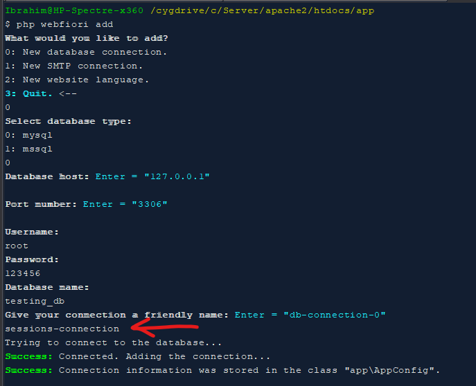
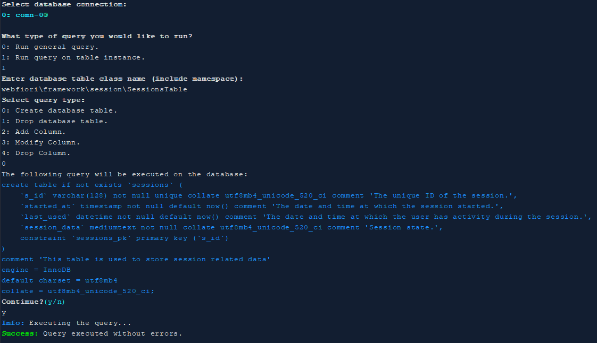

# Sessions Management

<meta name="description" content="Every web application must have a way to manage users sessions. The management may differe from one web development framework to another. A session in simple terms is a way to keep track of user intractions through a web application.">

In this page:
* [Introduction](#introduction)
* [Starting New Session](#starting-new-session)
  * [Customizing The Session](#customizing-the-session)
* [Resuming a Session](#resuming-a-session)
* [Destroying a Session](#destroying-a-session)
* [Adding Data to a Session](#adding-data-to-a-session)
* [Retrieving Stored Data](#retrieving-stored-data)
* [Generating New ID](#generating-new-id)
* [Creating Custom Sessions Storage](#creating-custom-sessions-storage)
* [Configuring Database Session Storage](#configuring-database-session-storage)

## Introduction

Every web application must have a way to manage user sessions. The management may differe from one web development framework to another. A session in simple terms is a way to keep track of user intractions through a web application. They can be used to keep state between different requests for the same user. WebFiori framework provides one class at which the developer can use to manage application sessions. The name of the class is [`SessionsManager`](https://webfiori.com/docs/webfiori/framework/session/SessionsManager). Sessions in WebFiori framework can be used with and without HTTP as long as the client keep session ID in his side.

## Starting New Session

Starting new session is very simple. The developer can use the method [`SessionsManager::start()`](https://webfiori.com/docs/webfiori/framework/session/SessionsManager#start). This method accepts two parameters. The first one is session name and the second one is an associative array of options. Calling this method will create new session which is persistent. The duration of the session will be 2 hours.

``` php
SessionsManager::start('hello-session');
Response::append(SessionsManager::getActiveSession()->toJSON());
```

The output of the code would be something similar to this:

``` json
{
    "name": "hello-session",
    "started-at": 1597509807,
    "duration": 7200,
    "resumed-at": 1597509807,
    "passed-time": 0,
    "remaining-time": 7200,
    "language": "EN",
    "id": "d01de401aa3d7f29eb24f6eb74a5225d473f2e1c54b9f4cb6d9fc9cc3de87f41",
    "is-refresh": false,
    "is-persistent": true,
    "status": "status_new",
    "user": {
        "user-id": -1,
        "email": "",
        "display-name": null,
        "username": ""
    },
    "vars": []
}
```
### Customizing The Session

It is possible to customize the session and set the following properties during initialization:
* Duration of the sesstion.
* Is the session will be refreshed with every request or not.
* Make the session non-persistent.

The following code shows how to create create a session with specific duration and it's remaining time refreshes with every request.

``` php 
SessionsManager::start('hello-session', [
    'duration' => 30, // 30 Minutes
    'refresh' => true
]);
```

To create a non-persistent session, use the value 0 for session duration. If the duration is 0, the session will be destroyed once the user closes his web browser.

## Resuming a Session

To resume a session, the developer simply have to use the same method which is used to start a new session. The following code sample shows how to start a new session, close it and resume it again. Note that when resuming a session, options array is ignored.

``` php
SessionsManager::start('hello-session');
SessionsManager::close();
SessionsManager::start('hello-session');
Response::append(SessionsManager::getActiveSession()->toJSON());
```

## Destroying a Session

To destroy an active session, The developer have to call the method  [`SessionsManager::destroy()`](https://webfiori.com/docs/webfiori/framework/session/SessionsManager#destroy). After starting or resuming the session.

``` php
SessionsManager::start('hello-session');
SessionsManager::destroy();
```

This method can be used in case the user has performed an action like logout.

## Adding Data to a Session

It is possible to store data in the session for use across different requests. For example, it is possible to create a shopping cart and add items to it. To add values to an active session or to update an existing value, the method [`SessionsManager::set()`](https://webfiori.com/docs/webfiori/framework/session/SessionsManager#set) can be used.
``` php
SessionsManager::start('hello-session');
SessionsManager::set('products', [
    'Apple', 'Orange', 'Lemon'
]);
```

## Retrieving Stored Data

There are two ways at which data can be retrived from an active session. One way is to get the data without removing it. This can be achived using the method [`SessionsManager::get()`](https://webfiori.com/docs/webfiori/framework/session/SessionsManager#get). And the other way is to pull the data using the method [`SessionsManager::pull()`](https://webfiori.com/docs/webfiori/framework/session/SessionsManager#pull). The pull method will remove the value from the session once retrived.

``` php
SessionsManager::start('hello-session');
SessionsManager::set('var-1', 'Hello World!');
SessionsManager::set('var-2', 'Hello World Again!');

$v1 = SessionsManager::get('var-1');
$v2 = SessionsManager::pull('var-2');
$v3 = SessionsManager::get('var-1');
$v4 = SessionsManager::pull('var-2');

//$v1 and $v3 will have same value
//$v4 will be null
```

## Generating New ID

In some cases, the ID of the session must be changed to prevent malicious users from exploiting a [session fixation](https://en.wikipedia.org/wiki/Session_fixation) attack on the system. The developer can generate new session ID for the active using the method [`SessionsManager::newId()`](https://webfiori.com/docs/webfiori/framework/session/SessionsManager#newId)

``` php
SessionsManager::start('hello-session');
Response::append('Old Session ID: '.SessionsManager::getActiveSession()->getId().'<br/>');
SessionsManager::newId();
// This will show different ID.
Response::append('New Session ID: '.SessionsManager::getActiveSession()->getId().'<br/>');
```

## Creating Custom Sessions Storage

By default, the framework will use default sessions storage engine which is represented by the class [`DefaultSessionStorage`](https://webfiori.com/docs/webfiori/framework/session/DefaultSessionStorage). This storage engine will store all session data in files which will be found in the directory `app/sto/sessions`.

Creating new sessions storage is very simple. For example, the developer might want to use database to store session data.

### Creating Database Table

First step, developer must create new database table class which will be used later on to store sessions.

``` php

namespace app\database;

use webfiori\database\mysql\MySQLTable;

class SessionsTable extends MySQLTable {
    /**
     * Creates new instance of the class.
     */
    public function __construct(){
        parent::__construct('sessions');
        $this->setComment('This table is used to store session related data');
        $this->addColumns([
            's-id' => [
                'type' => 'varchar',
                'size' => '128',
                'primary' => true,
                'is-unique' => true,
                'comment' => 'The unique ID of the session.',
            ],
            'started-at' => [
                'type' => 'timestamp',
                'default' => 'now()',
                'comment' => 'The date and time at which the session started.',
            ],
            'last-used' => [
                'type' => 'datetime',
                'default' => 'now()',
                'comment' => 'The date and time at which the user has activity during the session.',
            ],
            'session-data' => [
                'type' => 'mediumtext',
                'comment' => 'Session state.',
            ],
        ]);
    }
}

```

### Implementing Database Access Methods

Next step, the developer need to create a class which will be used to execute queries against the table to insert, update and delete sessions. Developer must extend the class [`DB`](https://webfiori.com/docs/webfiori/framework/DB) and add logic in the new class. In addition to that, developer must make the class implement the interface [SessionStorage](https://webfiori.com/docs/webfiori/framework/session/SessionStorage). The interface has all methods needed to have a functional sessions storage engine.

``` php 
namespace app\database;

use webfiori\framework\DB;
use app\database\SessionsTable;
use webfiori\framework\session\SessionStorage;

class SessionsDatabase extends DB implements SessionStorage {

    public function __construct() {
         //Replace connection_to_use with the connection 
         //of the database which will be used to store sessions.
         parent::__construct('connection_to_use');
         
         //We need to add the table to the instance.
         $this->addTable(new SessionsTable());
    }
    
    public function read($sId) {
        $this->table('sessions')->select()->where('s-id', '=', $sId)->execute();
        $resultSet = $this->getLastResultSet();
        if ($resultSet->getRowsCount() == 1) {
            return $resultSet->getRows()[0]['session_data'];
        }
    }
    
    public function save($sId, $session) {
        $sData = $this->getSession($sId);
        if ($sData !== null) {
            $this->table('sessions')->update([
                'session-data' => $session,
                'last-used' => date('Y-m-d H:i:s')
            ])->where('s-id', '=', $sId)->execute();
        } else {
            $this->table('sessions')->insert([
                's-id' => $sId,
                'session-data' => $session,
                'last-used' => date('Y-m-d H:i:s'),
                'started-at' => date('Y-m-d H:i:s'),
            ])->execute();
        }
    }
    
    public function gc() {
        if (defined('SESSION_GC') && SESSION_GC > 0) {
            $olderThan = time() - SESSION_GC;
        } else {
            //Clear any sesstion which is older than 30 days
            $olderThan = time() - 60 * 60 * 24 * 30;
        }
        $date = date('Y-m-d H:i:s', $olderThan);
        $ids = $this->getSessionsIDs($date);
        foreach ($ids as $id) {
            $this->removeSession($id);
        }
    }
    
    public function remove($sId) {
        $this->table('sessions')->delete()->where('s-id', '=', $sId)->execute();
    }
    
    //Helper method for gc
    public function getSessionsIDs($olderThan) {
        $this->table('sessions')->select()->where('last-used', '<=', $olderThan)->execute();
        $resultSet = $this->getLastResultSet();
        $resultSet->setMappingFunction(function ($data) {
            $retVal = [];
            foreach ($data as $record) {
                $retVal[] = $record['s_id'];
            }
            return $retVal;
        });
        return $resultSet->getMappedRows();
    }
}
```

The last step is to use the newly created sessions storage engine. In order to have the framework use the new sessions manager, developer have to define the constant `WF_SESSION_STORAGE` in the class [`GlobalConstants`](https://webfiori.com/docs/webfiori/ini/GlobalConstants). The value of the constant must be the value of the namespace and the class name of session storage (e.g. `\app\database\SessionsDatabase`). Once done, the framework will use this engine.

## Configuring Database Session Storage

By default, the framework comes with two session storage engines. One is the default one which uses files and the other one which uses database (One for MySQL and one for MSSQL). In order to be able to use database session storage, it must be first configured. Configuration steps are as follows:

* Setting the value of the constant `WF_SESSION_STORAGE` to `\webfiori\framework\session\DatabaseSessionStorage`.
* Adding a database connection with the name `sessions-connection` using the command `add`.
* Creating the table that will store the sessions using the command `run-query`.

### Setting the Value of The Constant `WF_SESSION_STORAGE`

Inside the class `GlobalConstants`, there exist a place at which the constant is defined. If it does not exist, simply define it as follows:
``` php
define('WF_SESSION_STORAGE', '\webfiori\framework\session\DatabaseSessionStorage');
```

### Adding Database Connection

To add the connection which will be used by database session storage, run the following command:
```
php webfiori add
```
From the menu, select the first option. Then it will start by asking about connection information. When the command asks about connection name, enter `sessions-connection`. The following image shows how the connection is added.



### Initializing Database Table

The final step is to initialize the table that will hold sessions data. First step in initializing the table is to run the following command:

```
php webfiori run-query --schema=webfiori\framework\session\SessionOperations
```

This command will ask to select what type of query that will be executed on the schema which is used to store the tables for sessions management. The developer must select the first option to run a query which will create all tables that are used to store sessions.

The following image shows all command execution steps.



**Next: [The Library WebFiori JSON](learn/webfiori-json)**

**Previous: [Command Line Interface](learn/command-line-interface)**
