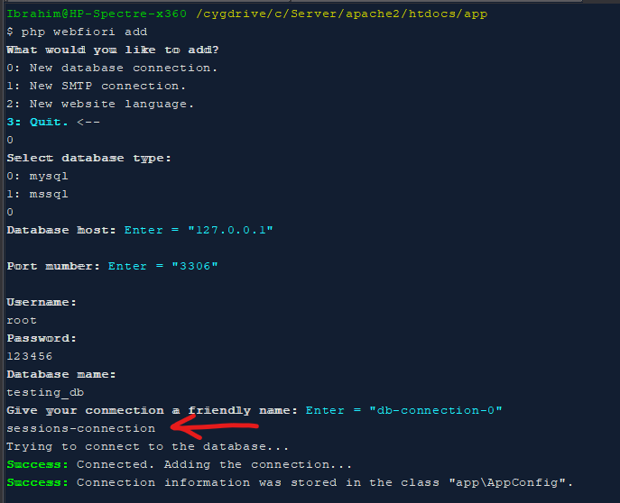

# Sessions Management

<meta name="description" content="Every web application must have a way to manage users sessions. The management may differe from one web development framework to another. A session in simple terms is a way to keep track of user intractions through a web application.">

In this page:
* [Introduction](#introduction)
* [Starting New Session](#starting-new-session)
  * [Customizing The Session](#customizing-the-session)
* [Resuming a Session](#resuming-a-session)
* [Destroying a Session](#destroying-a-session)
* [Adding Data to a Session](#adding-data-to-a-session)
* [Retrieving Stored Data](#retrieving-stored-data)
* [Generating New ID](#generating-new-id)
* [Garbage Collection](#garbage-collection)
* [Concurrency and Multi-Worker Support](#concurrency-and-multi-worker-support)
* [Creating Custom Sessions Storage](#creating-custom-sessions-storage)
* [Configuring Database Session Storage](#configuring-database-session-storage)
  * [Using Cache Session Storage (Redis)](#using-cache-session-storage-redis)
  * [Configuring Database Session Storage](#configuring-database-session-storage-1)

## Introduction

Every web application must have a way to manage user sessions. The management may differ from one web development framework to another. A session in simple terms is a way to keep track of user interactions through a web application. They can be used to keep state between different requests for the same user. WebFiori framework provides one class at which the developer can use to manage application sessions. The name of the class is [`SessionsManager`](https://webfiori.com/docs/WebFiori/Framework/Session/SessionsManager). Sessions in WebFiori framework can be used with and without HTTP as long as the client keep session ID in his side.

## Starting New Session

Starting new session is very simple. The developer can use the method [`SessionsManager::start()`](https://webfiori.com/docs/WebFiori/Framework/Session/SessionsManager#start). This method accepts two parameters. The first one is session name and the second one is an associative array of options. Calling this method will create new session which is persistent. The duration of the session will be 2 hours.

``` php
use WebFiori\Framework\Session\SessionsManager;
use WebFiori\Framework\App;

SessionsManager::start('hello-session');
App::getResponse()->write(SessionsManager::getActiveSession()->toJSON());
```

The output of the code would be something similar to this:

``` json
{
    "name": "hello-session",
    "started-at": 1597509807,
    "duration": 7200,
    "resumed-at": 1597509807,
    "passed-time": 0,
    "remaining-time": 7200,
    "language": "EN",
    "id": "d01de401aa3d7f29eb24f6eb74a5225d473f2e1c54b9f4cb6d9fc9cc3de87f41",
    "is-refresh": false,
    "is-persistent": true,
    "status": "status_new",
    "user": {
        "user-id": -1,
        "email": "",
        "display-name": null,
        "username": ""
    },
    "vars": []
}
```
### Customizing The Session

It is possible to customize the session and set the following properties during initialization:
* Duration of the session.
* Is the session will be refreshed with every request or not.
* Make the session non-persistent.

The following code shows how to create a session with specific duration and it's remaining time refreshes with every request.

``` php 
SessionsManager::start('hello-session', [
    'duration' => 30, // 30 Minutes
    'refresh' => true
]);
```

To create a non-persistent session, use the value 0 for session duration. If the duration is 0, the session will be destroyed once the user closes his web browser.

## Resuming a Session

To resume a session, the developer simply have to use the same method which is used to start a new session. The following code sample shows how to start a new session, close it and resume it again. Note that when resuming a session, options array is ignored.

``` php
SessionsManager::start('hello-session');
SessionsManager::close();
SessionsManager::start('hello-session');
App::getResponse()->write(SessionsManager::getActiveSession()->toJSON());
```

## Destroying a Session

To destroy an active session, The developer have to call the method [`SessionsManager::destroy()`](https://webfiori.com/docs/WebFiori/Framework/Session/SessionsManager#destroy). After starting or resuming the session.

``` php
SessionsManager::start('hello-session');
SessionsManager::destroy();
```

This method can be used in case the user has performed an action like logout.

### Session Status and Information

You can get information about the current session:

``` php
SessionsManager::start('hello-session');

$session = SessionsManager::getActiveSession();
echo "Session ID: " . $session->getId() . "\n";
echo "Session Name: " . $session->getName() . "\n";
echo "Duration: " . $session->getDuration() . " minutes\n";
echo "Remaining Time: " . $session->getRemainingTime() . " minutes\n";
echo "Is Persistent: " . ($session->isPersistent() ? 'Yes' : 'No') . "\n";
echo "Status: " . $session->getStatus() . "\n";
```

## Adding Data to a Session

It is possible to store data in the session for use across different requests. For example, it is possible to create a shopping cart and add items to it. To add values to an active session or to update an existing value, the method [`SessionsManager::set()`](https://webfiori.com/docs/WebFiori/Framework/Session/SessionsManager#set) can be used.

``` php
SessionsManager::start('hello-session');
SessionsManager::set('products', [
    'Apple', 'Orange', 'Lemon'
]);

// You can also store complex data structures
SessionsManager::set('user', [
    'id' => 123,
    'name' => 'John Doe',
    'email' => 'john@example.com',
    'preferences' => [
        'theme' => 'dark',
        'language' => 'en'
    ]
]);

// Store simple values
SessionsManager::set('cart_total', 45.99);
SessionsManager::set('last_page', '/products');
```

## Retrieving Stored Data

There are two ways at which data can be retrieved from an active session. One way is to get the data without removing it. This can be achieved using the method [`SessionsManager::get()`](https://webfiori.com/docs/WebFiori/Framework/Session/SessionsManager#get). And the other way is to pull the data using the method [`SessionsManager::pull()`](https://webfiori.com/docs/WebFiori/Framework/Session/SessionsManager#pull). The pull method will remove the value from the session once retrieved.

``` php
SessionsManager::start('hello-session');
SessionsManager::set('var-1', 'Hello World!');
SessionsManager::set('var-2', 'Hello World Again!');

$v1 = SessionsManager::get('var-1');
$v2 = SessionsManager::pull('var-2');
$v3 = SessionsManager::get('var-1');
$v4 = SessionsManager::pull('var-2');

//$v1 and $v3 will have same value
//$v4 will be null

// Remove a specific variable
SessionsManager::remove('temporary_data');

// Get all session variables
$allVars = SessionsManager::getActiveSession()->getVars();
```

## Generating New ID

In some cases, the ID of the session must be changed to prevent malicious users from exploiting a [session fixation](https://en.wikipedia.org/wiki/Session_fixation) attack on the system. The developer can generate new session ID for the active using the method [`SessionsManager::newId()`](https://webfiori.com/docs/WebFiori/Framework/Session/SessionsManager#newId)

``` php
SessionsManager::start('hello-session');
App::getResponse()->write('Old Session ID: '.SessionsManager::getActiveSession()->getId().'<br/>');
SessionsManager::newId();
// This will show different ID.
App::getResponse()->write('New Session ID: '.SessionsManager::getActiveSession()->getId().'<br/>');
```

## Garbage Collection

Expired sessions are cleaned up automatically using probabilistic garbage collection (similar to PHP's native session GC). By default, GC runs with a probability of 1/1000 on each request.

Configure GC behavior:

``` php
// Set probability: GC runs with probability/divisor chance on each request
// Default: 1/1000 (0.1% chance per request)
SessionsManager::setGCProbability(1, 100); // 1% chance per request

// Limit how many expired sessions are cleaned per GC run
// Useful for large session stores to prevent long pauses
SessionsManager::setGCBatchSize(50); // Clean at most 50 sessions per run

// Check current settings
echo SessionsManager::getGCProbability(); // numerator
echo SessionsManager::getGCDivisor();     // denominator
echo SessionsManager::getGCBatchSize();   // max per run (0 = unlimited)
```

To disable GC entirely (e.g., if you handle cleanup externally via cron):

``` php
SessionsManager::setGCProbability(0, 0);
```

You can also set the `SESSION_GC` environment variable to control the expiry threshold in seconds.

## Concurrency and Multi-Worker Support

> **Since 3.1**

In multi-process environments — such as **IIS with FastCGI**, PHP-FPM with more than one worker, or any setup where multiple PHP processes can serve the same user session concurrently — the old snapshot-isolation model could silently lose writes. When two workers read the same session at the same time and both save it at the end of their request, the last writer overwrites the other's changes.

Starting in 3.1, sessions use a **per-key real-time storage model**: every `set()` writes to storage immediately (no batch-save at request end), and every `get()` reads the current value from storage directly. This eliminates both problems:

- **Visibility:** Process B immediately sees a key written by Process A — no stale snapshot.
- **No lost writes:** Per-key writes mean two processes modifying different keys never clobber each other.

### Read Strategies

The read behaviour is controlled by `ReadStrategy`, configurable per session. The default is `REALTIME`, which is correct for multi-worker deployments.

| Strategy | Behaviour | Use case |
|---|---|---|
| `REALTIME` (default) | Every `get()` reads from storage | IIS/FastCGI, any multi-worker host |
| `SNAPSHOT_WITH_MISS` | Snapshot at start; reads storage on cache miss | Low-contention apps wanting fewer I/O calls |
| `MANUAL_SYNC` | Snapshot at start; developer calls `refresh()` | Long-running requests (SSE streaming) with explicit sync points |

### Conflict Strategies

When two processes write the same key, the conflict resolution is controlled by `ConflictStrategy`. The default is `LAST_WRITE_WINS`, which preserves backward compatibility.

| Strategy | Behaviour | Use case |
|---|---|---|
| `LAST_WRITE_WINS` (default) | Overwrite regardless — no exception | Most session writes (theme, cart, flash messages) |
| `REJECT` | Throw `SessionConflictException` on version mismatch | Explicit conflict handling required |
| `RETRY_WITH_CALLBACK` | Re-read current value, call callback to compute new value | Counters, aggregations |

### Configuring Strategies via Middleware

The cleanest way to configure strategies is through `StartSessionMiddleware` at route-registration time. Different routes can use different strategies.

``` php
use WebFiori\Framework\Middleware\StartSessionMiddleware;
use WebFiori\Framework\Session\ReadStrategy;
use WebFiori\Framework\Session\ConflictStrategy;

// Normal API routes — real-time reads, last-write-wins (the defaults)
new StartSessionMiddleware();

// SSE / long-running streaming route — manual sync, explicit refresh
new StartSessionMiddleware(
    readStrategy: ReadStrategy::MANUAL_SYNC,
    conflictStrategy: ConflictStrategy::LAST_WRITE_WINS
);

// Critical write path — reject concurrent modifications explicitly
new StartSessionMiddleware(
    readStrategy: ReadStrategy::REALTIME,
    conflictStrategy: ConflictStrategy::REJECT
);
```

### Manual Sync for SSE / Long-running Requests

When using `MANUAL_SYNC`, call `Session::refresh()` at each sync boundary to pick up writes from other processes:

``` php
$session = SessionsManager::getActiveSession();

// SSE event loop
while (true) {
    $session->refresh();   // pick up writes from other workers
    $notification = $session->get('notification');

    if ($notification) {
        echo "data: $notification\n\n";
        ob_flush(); flush();
        $session->remove('notification');
    }

    sleep(1);
}
```

### Conflict Handling with REJECT

``` php
use WebFiori\Framework\Session\SessionConflictException;

try {
    SessionsManager::set('counter', 42, ConflictStrategy::REJECT);
} catch (SessionConflictException $e) {
    // Another process modified 'counter' between our read and write.
    // $e->getConflictKey(), $e->getExpectedVersion(), $e->getActualVersion()
}
```

### Retry with Callback for Counters

``` php
use WebFiori\Framework\Session\ConflictStrategy;

// Safely increment a counter even under concurrent access
$session->set(
    'page_views',
    null,
    ConflictStrategy::RETRY_WITH_CALLBACK,
    fn($current) => ($current ?? 0) + 1
);
```

### Testing with InMemorySessionStorage

> **Since 3.1**

`InMemorySessionStorage` ships with the framework and is ideal for application-level tests — no files or databases required:

``` php
use WebFiori\Framework\Session\InMemorySessionStorage;
use WebFiori\Framework\Session\SessionsManager;

// In your test setUp
InMemorySessionStorage::reset();
SessionsManager::setStorage(new InMemorySessionStorage());
```

## Creating Custom Sessions Storage

By default, the framework will use default sessions storage engine which is represented by the class [`DefaultSessionStorage`](https://webfiori.com/docs/WebFiori/Framework/Session/DefaultSessionStorage). This storage engine will store all session data in files which will be found in the directory `[APP_DIR]/Storage/Sessions`.

### New per-key interface (since 3.1)

> **Since 3.1**

Starting in 3.1, the `SessionStorage` interface uses a **per-key contract** instead of a whole-session blob. Implement these six methods:

``` php
use WebFiori\Framework\Session\SessionStorage;
use WebFiori\Framework\Session\ConflictStrategy;
use WebFiori\Framework\Session\SessionConflictException;

class MyCustomStorage implements SessionStorage {

    /**
     * Read a single key. Returns ['value' => mixed, 'version' => int] or null.
     */
    public function read(string $sessionId, string $key): ?array {
        // fetch from your backend
    }

    /**
     * Read all keys for a session.
     * Returns ['key1' => ['value' => ..., 'version' => int], ...]
     */
    public function readAll(string $sessionId): array {
        // fetch all keys from your backend
    }

    /**
     * Write a single key. Returns the new version number.
     * Throw SessionConflictException when strategy is REJECT and versions mismatch.
     */
    public function write(
        string $sessionId,
        string $key,
        mixed $value,
        string|int|null $expectedVersion,
        ConflictStrategy $strategy
    ): string|int {
        // persist key; handle REJECT strategy
    }

    /**
     * Remove a single key.
     */
    public function remove(string $sessionId, string $key): void {
        // delete the key
    }

    /**
     * Destroy all keys for a session.
     */
    public function destroy(string $sessionId): void {
        // delete the whole session
    }

    /**
     * Garbage collect sessions older than $olderThan.
     */
    public function gc(string $olderThan, int $maxCount = 0): void {
        // clean up expired sessions
    }
}
```

Then register it:

``` php
use WebFiori\Framework\Session\SessionsManager;

SessionsManager::setStorage(new MyCustomStorage());
```

### Migrating a legacy custom storage driver

> **Since 3.1**

If you have an existing custom storage class that implements the old `read()/save()` contract, wrap it in `LegacySessionStorageAdapter` to keep it working without code changes. Note that the adapter provides **no conflict detection** — concurrent writes may still lose data. Migrate to the new interface to gain full real-time support.

``` php
use WebFiori\Framework\Session\LegacySessionStorageAdapter;
use WebFiori\Framework\Session\SessionsManager;

// MyOldStorage implements the old read()/save()/remove()/gc() interface
SessionsManager::setStorage(
    new LegacySessionStorageAdapter(new MyOldStorage())
);
```

### Legacy interface (pre-3.1, deprecated)

> **Deprecated since 3.1.** Use the new per-key `SessionStorage` interface above, or wrap existing implementations in `LegacySessionStorageAdapter`. The old contract will be removed in v4.

The old interface required `read(string $sessionId): ?string`, `save(string $sessionId, string $serializedSession)`, `remove(string $sessionId)`, and `gc()`. Existing implementations using these signatures are still supported via `LegacySessionStorageAdapter`.

## Configuring Database Session Storage

By default, the framework comes with three session storage engines:
* **File-based** ([`DefaultSessionStorage`](https://webfiori.com/docs/WebFiori/Framework/Session/DefaultSessionStorage)) — stores sessions as per-key entries in files in `[APP_DIR]/Storage/Sessions`.
* **Database-backed** ([`DatabaseSessionStorage`](https://webfiori.com/docs/WebFiori/Framework/Session/DatabaseSessionStorage)) — stores each session key as a row in `session_kv_data`.
* **Cache-backed** ([`CacheSessionStorage`](https://webfiori.com/docs/WebFiori/Framework/Session/CacheSessionStorage)) — stores each session key as a separate cache entry.

### Using Cache Session Storage (Redis)

The `CacheSessionStorage` delegates to the cache library's `Storage` interface, which means any cache backend works — including Redis for horizontal scaling.

``` php
define('WF_SESSION_STORAGE', '\WebFiori\Framework\Session\CacheSessionStorage');
```

To configure it, register the storage in your application initialization:

``` php
use WebFiori\Cache\RedisStorage;
use WebFiori\Framework\Session\CacheSessionStorage;
use WebFiori\Framework\Session\SessionsManager;

$redis = new \Redis();
$redis->connect('127.0.0.1', 6379);

$storage = new CacheSessionStorage(
    new RedisStorage($redis),  // Any cache Storage implementation
    'wf_session:',             // Key prefix (default)
    7200                       // TTL in seconds (default: 2 hours)
);
SessionsManager::setStorage($storage);
```

You can also use file-based caching:

``` php
use WebFiori\Cache\FileStorage;
use WebFiori\Framework\Session\CacheSessionStorage;
use WebFiori\Framework\Session\SessionsManager;

$storage = new CacheSessionStorage(new FileStorage('/path/to/cache/sessions'));
SessionsManager::setStorage($storage);
```

The key prefix ensures session cache entries don't collide with application cache data.

### Configuring Database Session Storage

Setting up database session storage requires three steps:

1. Setting the value of the constant `WF_SESSION_STORAGE` to `\WebFiori\Framework\Session\DatabaseSessionStorage`.
2. Adding a database connection with the name `sessions-connection` using the command `add:db-connection`.
3. Running the schema migration to create the required database tables.

### Setting the Value of The Constant `WF_SESSION_STORAGE`

Inside the class `[APP_DIR]\config\Env`, there exist a place at which the constant is defined. If it does not exist, simply define it as follows:
``` php
define('WF_SESSION_STORAGE', '\WebFiori\Framework\Session\DatabaseSessionStorage');
```

### Adding Database Connection

To add the connection which will be used by database session storage, run the following command:
```
php webfiori add:db-connection
```
When the command asks about connection name, enter `sessions-connection`.



### Initializing Database Tables

> **Since 3.1**

Run the `SessionSchemaMigration` helper once after deployment. It creates the `sessions` table and the `session_kv_data` per-key table, and safely adds the `version`/`updated_at` columns if upgrading from a previous installation.

``` php
use WebFiori\Framework\Session\SessionSchemaMigration;

// Run once — safe to call on an existing installation
SessionSchemaMigration::run('sessions-connection');
```

You can call this from a one-off CLI command or a migration script. It is idempotent: running it multiple times on the same database is safe.

> **Upgrading from 3.0.x:** Existing sessions stored in the old blob format are not automatically migrated. Users will need to log in again after the migration. The old `session_data` table is preserved and not dropped.

## Related Articles

* [Middleware](learn/middleware) - Implement authentication middleware using sessions
* [Web Services](learn/web-services) - Manage user sessions in API endpoints
* [Database Management](learn/database) - Store session data in database
* [The Library WebFiori JSON](learn/webfiori-json) - Store JSON data in sessions
* [Command Line Interface](learn/command-line-interface) - Configure session storage via CLI
